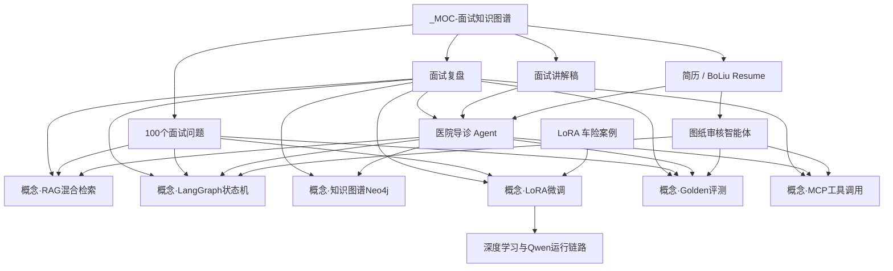

# MOC · 面试知识图谱

> 入口笔记。在 Obsidian 打开本页 → 右侧 **反向链接** / 顶部 **关系图谱**，即可看到整张网。  
> 更新原则：新面试只改 [[面试复盘]]；新技术点先链到下方「概念」，再链回项目与题库。

---

## 一、面试作战层（先看这些）

| 笔记 | 用途 |
|------|------|
| [[面试复盘]] | 各场真实问答、踩坑、可复用答案 |
| [[面试讲解稿]] | 导诊项目口述稿 + 高频 Q&A |
| [[简历]] | 中文简历主稿 |
| [[简历懂王]] | 简历变体 |
| [[BoLiu_AI_Agent_Engineer_Resume]] | 英文简历 |
| [[100个面试问题]] | 按维度准备的题库与参考答 |
| [[智能体工程师-AI工程师岗位要求]] | 对方会怎么考你（图纸项目视角） |
| [[大模型开发]] | 职业路径 / 能力地图 |

---

## 二、项目证据层（面试时用来「举证」）

| 项目 | 笔记 |
|------|------|
| 医院导诊 Agent | [[面试讲解稿]] · [[TodoList导诊]] · [[面试复盘]] |
| 图纸审核智能体 | [[零部件图纸审核智能体-项目文档]] · [[图纸审核智能体-项目资源与报价]] · [[智能体工程师-AI工程师岗位要求]] |
| LoRA / 多模态案例 | [[Lora基本流程车险理赔]] |
| 底层理解 | [[深度学习本质与 Qwen3-8B 运行链路深度解析]] |

---

## 三、技术概念层（图谱节点）

把复盘里反复出现的考点抽成「概念页」，避免只在某一场面试里沉没：

- [[概念-RAG混合检索]]
- [[概念-LangGraph状态机]]
- [[概念-知识图谱Neo4j]]
- [[概念-LoRA微调]]
- [[概念-Golden评测]]
- [[概念-MCP工具调用]]

---

## 四、复盘里出现过的公司 / 场次（索引）

在 [[面试复盘]] 内按公司标题跳转；此处只做目录：

- 零食有鸣 · 1STEP.AI · 德科 · 培训班模拟面  
- 南昌万宜 · 华迪信息 · 新致软件 · 拓保软件 · 四川安正  
- 交易所 · 京北方/青岛银行 · 慧择 · 中通服创立  

---

## 五、怎么用这张图

1. **面完一场** → 只往 [[面试复盘]] 追加问答 → 若出现新考点，在对应「概念-xxx」里加一条链接。  
2. **准备下一场** → 打开本 MOC → 点概念页刷题 → 再用 [[面试讲解稿]] 练口述。  
3. **看图谱** → Obsidian 左侧打开「关系图谱」→ 以本笔记为中心，或筛选文件夹 `20 Projects/面试`。

#moc #面试
