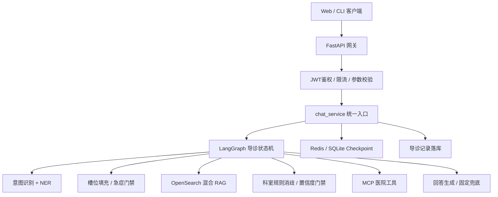
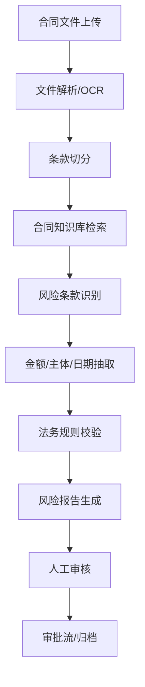

# JD匹配：AI工程师 Agent架构与RAG项目回答稿

> 适用岗位：AI Agent应用开发工程师 / AI应用工程师 / 智能体开发工程师  
> 主项目口径：医院导诊 Agentic 助手  
> 辅助项目口径：SSG 企业问数 / 医学证据研究 Agent 方案  
> 回答原则：用真实项目讲工程落地；未实际落地的 AutoGen、Deep Agents、GraphRAG、微调、OCR 不包装成已做经验，只讲选型理解和扩展方案。

---

## 0. 先记住这段总回答

如果面试官让你“完整讲一个从 0 到 1 的企业级智能体”，可以先这样开场：

> 我做的主项目是医院导诊 Agent，目标不是让大模型自由看病，而是把患者的自然语言描述转成可控的导诊流程：识别意图和实体、补齐必要槽位、判断急症、检索症状知识、根据科室规则消歧、置信度门禁、再调用医院工具查询值班和科室信息，最后给出安全兜底的导诊建议。  
> 
> 技术上我用 FastAPI 做服务入口，LangGraph 做有状态流程编排，OpenSearch 做 BM25 + kNN 混合检索，Redis / SQLite 做 Checkpoint 和会话持久化，MCP 接医院工具，Pydantic 做输入输出 Schema，Docker Compose 支持演示部署。  
> 
> 这个项目的重点不是一个 Prompt，而是把 Agent 做成可测试、可恢复、可降级的业务状态机。每个节点都有明确职责，低置信度不强答，急症规则优先，外部工具超时可降级，RAG 失败回退关键词检索，整条 chat 链路有超时兜底。评估上有 100 条 batch case 和 29 个 pytest 模块，当前开源评测里 intent accuracy 0.97、NER accuracy 0.81、综合通过 80/100。

一句话定位：

> 我更擅长的是企业级 AI 应用工程化：把 LLM、RAG、工具调用、状态机、评估和降级封装成可上线的业务系统，而不是只调模型 API。

---

## 1. Agent 核心机制与架构设计

### 1.1 从 0 到 1 怎么设计企业级智能体？

**短答**

> 我会按“业务边界 → 状态模型 → 工具与知识 → 编排图 → 风险兜底 → 评估闭环”的顺序做，而不是先写 Prompt。

**结合项目回答**

医院导诊场景的业务目标很明确：

- 用户输入症状或疾病，系统推荐合适科室。
- 系统只能做导诊，不做诊断，不给处方。
- 急症要优先提示线下急诊。
- 信息不足时要追问，不要硬推荐。
- 科室推荐必须可解释、可测试、可回归。

整体架构：



技术选型：

| 层次 | 选型 | 原因 |
|---|---|---|
| API | FastAPI | Python 生态成熟，异步接口友好，Pydantic Schema 易维护 |
| 编排 | LangGraph | 适合状态机、条件边、多轮澄清、Checkpoint |
| 检索 | OpenSearch | 同时支持 BM25、kNN、metadata filter 和服务化部署 |
| 模型 | DashScope 兼容 OpenAI SDK，主备模型 | 国内环境容易接入，便于封装 provider 和 fallback |
| 状态 | Redis / SQLite / MemorySaver | 支持会话恢复与本地演示降级 |
| 工具 | MCP mock HIS | 把值班、科室介绍、路线等外部系统封成工具 |
| 测试 | pytest + batch eval | 节点级、链路级、评估集回归 |

落地流程：

1. 先定义产品边界：导诊，不诊断，不开药。
2. 把用户输入分成 `disease / symptom / reject` 三条业务路由。
3. 设计 `AppState`，保存消息、NER、槽位、RAG 命中、候选科室、置信度、工具结果。
4. 用 LangGraph 把流程拆成 17 个节点，包括 `decision`、`slot_fill`、`emergency_gate`、`rag_symptom_recall`、`dept_disambiguation`、`dept_confidence`、`fetch_oncall`、`answer_generate`。
5. 搭建 OpenSearch 知识库，症状链路走 BM25 + kNN，疾病链路走结构化 KB。
6. 封装 MCP 工具，只在科室锁定后查询值班/介绍/路线。
7. 做稳定性兜底：LLM 主备、RAG 失败回退关键词、MCP 超时降级、整条 chat 超时兜底。
8. 做评估：100 条 batch case、Golden case、pytest 回归。

**踩坑与优化**

- 早期如果让 LLM 直接根据症状推荐科室，会出现解释很流畅但依据不稳定的问题。后来改成“RAG 召回 + 规则打分 + 置信度门禁”。
- 多轮澄清容易出现脏状态，比如上一轮“肚子疼”的槽位污染下一轮“脚痛”。后来把新主诉、拒答、完成等状态边界清理出来。
- 工具调用不能让模型随意发起。现在是业务状态先锁定科室，系统再决定是否调用 MCP。
- 只看最终回答没法定位问题，所以返回 `node_trace`，并把错误归因到 NER、召回、规则、置信度或工具层。

### 1.2 Memory、Planning、Tool Use、Reflection 怎么实现？

**Memory**

项目里把记忆分成三类：

| 记忆类型 | 实现 | 用途 |
|---|---|---|
| 短期对话记忆 | LangGraph Checkpoint | 多轮澄清、科室选择、追问续跑 |
| 运行状态记忆 | `AppState` | 当前槽位、RAG chunk、候选科室、置信度、工具结果 |
| 长期业务记录 | SQLite triage session | 审计、评估、bad case 分析 |

回答口径：

> 我没有把所有历史对话都粗暴塞进 Prompt，而是区分生命周期。多轮追问依赖 Checkpoint 恢复，业务状态放在 AppState，完整导诊记录单独落库。新主诉或流程结束时清理导诊状态，避免脏状态污染。

**Planning**

当前项目不是开放式 Auto Planning，而是确定性业务规划：

```text
输入
→ 意图/实体识别
→ 疾病链 or 症状链
→ 急症门禁
→ RAG/KB
→ 澄清/消歧
→ 置信度门禁
→ 工具调用
→ 输出
```

回答口径：

> 医疗导诊风险高，我没有让 LLM 自由规划每一步，而是用 LangGraph 条件边表达宏观计划，让 LLM 只处理局部语义任务。这样可控、可测、可回归。开放式研究 Agent 才更适合 ReAct 或 plan-and-execute。

**Tool Use**

项目中的工具调用是 MCP：

- `get_oncall_appointments`：查科室值班/预约。
- `get_department_intro`：查科室介绍。
- `get_department_route`：查院内路线。

工具使用原则：

```text
先有业务状态 → 再校验参数 → 再调用工具 → 解析 JSON → 写入 AppState → 生成回答
```

回答口径：

> 我不会让 LLM 直接决定所有工具调用。模型可以辅助判断用户是否追问科室信息，但真正执行前，系统要校验工具白名单、科室是否锁定、参数 Schema 和超时策略。工具失败只降级工具信息，不推翻已经完成的导诊结论。

**Reflection**

当前项目没有做“多 Agent 自我辩论式 Reflection”，但有工程化质控：

- `dept_confidence`：对推荐科室做置信度评估。
- `low_confidence_reject`：低分不强答。
- Batch eval：用评估集找 bad case。
- node trace：定位失败节点。

回答口径：

> 我项目里更接近工程化 Reflection，不是让模型反复自言自语，而是在关键节点做置信度校验、低置信拒答、评估集回归和 bad case 归因。真正多角色反思适合医学证据研究、合同审核这类允许延迟更高的后台场景。

### 1.3 单 Agent vs 多 Agent 怎么选？

**选择原则**

| 场景 | 选择 | 原因 |
|---|---|---|
| 目标单一、流程明确、状态共享强 | 单 Agent + LangGraph | 可控、低延迟、易测试 |
| 多角色职责差异明显 | 多 Agent | 如审稿、法务、财务、医学安全多角色 |
| 长任务、需要文件和阶段产物 | Deep Agents | 适合研究报告、长文生成、证据综述 |
| 快速 POC / 业务人员维护 | Dify 类平台 | 上手快，但代码级控制较弱 |
| 企业级核心链路 | 自研编排 / LangGraph | 权限、审计、测试、降级更好控 |

**结合项目**

> 医院导诊我选单 Agent + LangGraph，因为它目标单一：推荐科室和风险分流。多 Agent 会带来角色通信、仲裁、重复调用和评估复杂度，收益不大。  
> 
> 如果是医学证据研究 Agent，我会考虑 Deep Agents 或 AutoGen。Deep Agents 负责长任务检索、写中间文件、生成报告；AutoGen 可以让“检索员、证据评估员、安全审查员、写作者”多角色互审。

### 1.4 长期运行、状态恢复、人工介入怎么设计？

回答结构：

```text
任务表 + 状态机 + 事件日志 + Checkpoint + 人工审核点 + 幂等工具调用
```

项目内已有：

- LangGraph Checkpoint：支持多轮状态恢复。
- `thread_id + user_id`：隔离用户会话。
- SQLite 导诊记录：保存每轮输入、输出、状态快照。
- 澄清节点：通过 `END` 暂停，等用户下一轮输入后继续。

企业级增强方案：

- 建 `agent_tasks` 表：`task_id、status、current_node、input、output、created_at、updated_at`。
- 每个节点写 `agent_events`：入参、出参、耗时、错误、token、工具调用。
- 对写操作工具加 `idempotency_key`。
- HITL 节点使用 `waiting_human` 状态，人工确认后再继续。
- 任务可取消、可重放、可从最近 Checkpoint 恢复。

面试回答：

> 长任务不能只靠内存里的循环。我的设计是任务状态持久化，节点执行可观测，外部写操作幂等，人工介入显式建模。导诊项目里已经用了 Checkpoint 和多轮澄清；如果扩展到合同审核或医学证据报告，我会把人工审核作为图里的一个暂停节点，审核通过后再继续执行后续工具或入库。

### 1.5 幻觉、工具失败、上下文丢失、死循环怎么兜底？

| 问题 | 排查 | 兜底 |
|---|---|---|
| 幻觉 | 看回答是否有检索依据、是否越过业务边界 | RAG 引用、规则门禁、低置信拒答、固定安全话术 |
| 工具失败 | 看工具入参、超时、返回 schema、外部服务状态 | retry、timeout、fallback、保留主结论 |
| 上下文丢失 | 查 `thread_id`、Checkpoint、历史裁剪、状态清理 | 状态快照、必要槽位持久化、重新澄清 |
| 死循环 | 看节点 trace、澄清轮数、条件边 | 最大轮数、最大步数、终止条件、fallback |

项目口径：

> 当前项目里，RAG 失败会回退关键词，MCP 默认 5 秒超时，整条 chat 默认 60 秒超时，低置信科室会拒答，急症规则会抢占普通流程。还需要补的是统一 tenacity 指数退避和 `chat_service` 全异常兜底，这个我会如实说明，不把待办包装成已完成。

---

## 2. RAG 深度实战

### 2.1 企业知识库 + RAG 全流程怎么讲？

**项目版回答**

> 我在导诊项目里维护了三类知识：症状 RAG、疾病到科室的结构化 KB、科室规则。症状链路用 OpenSearch 做 BM25 + kNN 混合召回，疾病链路优先查结构化 KB，科室规则用于消歧和打分。RAG 不是把文档直接塞给模型，而是先召回标准症状和规则，再交给确定性流程判断。

全流程：

```text
原始资料
→ 清洗成 JSONL
→ 生成索引 mapping
→ embedding 入库
→ BM25 + kNN 混合检索
→ alias / alliance 精确命中重排
→ 科室规则消歧
→ 置信度评估
→ 回答生成
```

当前索引：

| 索引 | 用途 |
|---|---|
| `rag_knowledge` | 症状标准化、俗称归一、症状到候选科室 |
| `disease_kb` | 疾病名称、别名、推荐科室 |
| `rag_department_rules` | 按部位、伴随症状、年龄/性别做科室规则消歧 |

检索权重：

```text
BM25_WEIGHT = 0.4
KNN_WEIGHT = 0.6
```

BM25 字段加权：

```text
canonical_symptom^5
alliance^4
description^2
search_text
```

**为什么混合检索？**

> 医疗导诊里有很多精确术语和俗称，例如“胃疼、上腹痛、反酸、胃炎”。只用向量会漏精确名词，只用 BM25 又不够泛化。所以我用 BM25 保证关键词命中，用 kNN 处理自然语言表达，再做归一化融合。

### 2.2 召回不准、幻觉、上下文丢失、多文档冲突怎么解决？

**召回不准**

- 优先检查 query 是否被正确抽取。
- 看 top-k 是否命中标准症状。
- 加别名、同义词、俗称字段。
- 调整 BM25/kNN 权重。
- 加 metadata filter，比如年龄、性别、部位。
- bad case 进入回归集。

**幻觉**

- 回答只能基于锁定科室、RAG chunk、规则结果和工具结果。
- 无锁定科室时 `answer_generate` 禁用自由生成，返回固定兜底。
- 高风险急症用规则抢占。
- 低置信度拒答。

**上下文丢失**

- 用 `thread_id` 关联 Checkpoint。
- 多轮澄清状态存在 `clarify_state` / `dept_state`。
- 历史裁剪只裁消息，不丢必要业务槽位。

**多文档冲突**

当前导诊项目主要是规则型知识，不是大规模论文冲突。面试可以这样讲：

> 在当前导诊项目里，多文档冲突主要表现为同一症状候选多个科室。我通过科室规则、部位槽位、伴随症状、置信度门禁做消歧。  
> 
> 如果做医学证据研究 Agent，我会引入证据等级和来源优先级：指南 > 系统综述/Meta > RCT > 队列研究 > 病例研究 > 专家意见，并在报告里显式列出冲突结论和适用边界，而不是强行合成一个确定答案。

### 2.3 HyDE、Query Rewrite、Parent-Child、GraphRAG 怎么讲？

回答要分“已用”和“理解”：

| 方法 | 项目是否已落地 | 怎么回答 |
|---|---|---|
| Query Rewrite | 局部有类似思想 | NER、俗称归一、症状标准化，本质上是在改写检索入口 |
| Parent-Child Chunk | 当前未系统实现 | 医学指南/合同这类长文档适合，小 chunk 检索，大 parent 回填上下文 |
| HyDE | 未落地 | 适合 query 很短、语义稀疏时生成假想答案再检索，但医疗场景要小心幻觉污染 |
| GraphRAG | 未落地 | 适合实体关系密集，如疾病-症状-检查-药品-禁忌图谱；导诊 MVP 先不用 |
| Rerank | 有规则重排 | 当前有 alias / alliance 精确命中优先；后续可接 cross-encoder reranker |

面试口径：

> 我不会说项目已经完整用了 GraphRAG 或 HyDE。当前项目的进阶点主要是混合检索、结构化 KB、规则重排和 bad case 迭代。GraphRAG 更适合医学证据研究或药品知识图谱，不适合为了炫技塞进实时导诊主链路。

### 2.4 向量数据库怎么选？

| 选型 | 适合场景 | 我的判断 |
|---|---|---|
| OpenSearch | 关键词 + 向量 + 过滤 + 服务化 | 当前项目最合适 |
| FAISS | 本地高性能向量检索 | Demo 或离线检索好，服务化和权限要自己补 |
| Chroma | 原型、个人项目 | 上手快，生产能力有限 |
| Milvus | 百万/千万级向量、分布式 | 适合大规模知识库 |
| pgvector | 中小规模、强结构化业务 | 和 PostgreSQL 业务数据结合方便 |

面试回答：

> 选型不是看哪个框架热门，而是看数据规模、过滤条件、更新频率、运维成本和团队能力。导诊项目既要精确关键词又要向量语义，还要服务化部署，所以选 OpenSearch。百万级纯向量、多集合、多租户场景，我会考虑 Milvus；如果业务数据本身在 PostgreSQL，规模中等，我会优先评估 pgvector。

### 2.5 百万级文档怎么保证精度和速度？

设计思路：

```text
离线层：文档解析、去重、分块、embedding、索引构建、质量评估
在线层：query rewrite、metadata filter、多路召回、rerank、上下文压缩、缓存
运维层：分片、副本、增量更新、灰度索引、监控告警
```

关键措施：

- 按租户、业务域、文档类型、时间做 metadata filter，先缩小候选空间。
- 索引按业务域拆分，不把所有文档混在一个大索引。
- embedding 离线批量生成，避免在线重复计算。
- 热门 query、热门文档、rerank 结果做缓存。
- top-k 不盲目拉大，先召回 50-100，再 rerank 到 5-10。
- 用 blue-green index 做增量更新：新索引构建完成后别名切换。
- 建立 golden query 集，持续评估 Recall@k、MRR、答案命中率。

---

## 3. Prompt、工具、链路工程

### 3.1 现场写一个复杂业务 Prompt

可写“科室推荐置信度评估 Prompt”：

```text
你是医院导诊质控模块。请根据用户主诉、已抽取槽位、候选科室规则，评估当前推荐科室是否可信。

任务：
1. 判断推荐科室与主诉、部位、伴随症状是否一致。
2. 输出 0-100 分置信度。
3. 如果信息不足，分数应偏低。
4. 不要做疾病诊断，不要给处方建议。
5. 只返回 JSON，不要输出多余解释。

输入 JSON：
{
  "locked_department": "...",
  "primary_symptom": "...",
  "companion_symptoms": ["..."],
  "filled_slots": {
    "age": "...",
    "sex": "...",
    "pain_location": "...",
    "differential": "..."
  },
  "dept_rule": {
    "symptom_id": "...",
    "location": "...",
    "candidate_departments": ["..."]
  }
}

输出 JSON Schema：
{
  "score": 0-100,
  "reason": "简短中文理由",
  "slot_alignment": "科室与槽位一致性说明"
}
```

解释设计：

- 明确角色：质控模块，不是医生。
- 明确边界：不诊断，不开药。
- 输入结构化：减少模型猜测。
- 输出 JSON：便于程序读取和门禁。
- 分数可被业务阈值控制：低于 60 走拒答或转人工。

### 3.2 Function Calling / Tool Use 怎么保证稳定？

项目做法：

```text
工具白名单
→ Pydantic 参数 Schema
→ 业务前置条件
→ 超时控制
→ 返回 JSON 解析
→ 结果写入状态
→ 失败降级
```

结合 MCP：

> 当前项目 MCP 工具只在科室锁定后调用，避免用户随便一句话触发外部系统。工具初始化和调用有超时，返回结果解析后写入 `tool_call_result` 或 `oncall_appointments`。如果工具失败，回答仍然保留导诊结果，只提示“暂无法获取值班信息”。

应该补充的生产增强：

- 429 / 5xx / timeout 用 tenacity 指数退避。
- 遵守 `Retry-After`。
- 写操作加幂等 key。
- 工具结果加 schema 校验。
- 记录工具耗时、错误码、重试次数。

### 3.3 如何拆复杂业务流程？

方法：

1. 先画人工流程，而不是先画 Agent。
2. 标出每一步输入、输出、失败条件。
3. 判断这一步适合规则、RAG、LLM 还是 Tool。
4. 定义状态字段和终止条件。
5. 高风险写操作加人工确认。

导诊项目拆解：

```text
患者自然语言
→ 是否医疗相关
→ 疾病还是症状
→ 是否急症
→ 信息是否足够
→ 候选科室有哪些
→ 是否需要消歧
→ 置信度是否通过
→ 是否查询工具
→ 最终回答
```

### 3.4 流式输出、多轮对话、长上下文怎么落地？

当前项目重点是多轮，不是 token 级流式：

- API 返回结构化状态：`awaiting_clarify`、`awaiting_dept_choice`、`dept_choices`。
- 前端根据这些字段渲染按钮和多轮交互。
- LangGraph Checkpoint 保存状态。
- 历史消息有裁剪，避免上下文无限增长。

如果做流式输出：

- 普通文本可以 SSE / WebSocket。
- 工具调用阶段先返回事件：`retrieving`、`calling_tool`、`generating`。
- 最终结构化字段仍以完整 JSON 返回，不能只靠前端解析文本。

---

## 4. 工程落地与稳定性

### 4.1 FastAPI 异步怎么做？

项目口径：

> API 层使用 FastAPI，外部请求适合用 async。当前 LangGraph 主执行是同步调用，所以 `chat_once_async` 用 `run_in_executor` 放到线程池，再用 `asyncio.wait_for` 做整条链路超时，避免阻塞事件循环。MCP 客户端是异步调用，并设置独立超时。

要点：

- I/O 用 async，CPU 密集不要堵事件循环。
- 外部依赖都要有 timeout。
- 线程池要限制并发，避免压垮服务。
- 接口返回结构化响应，不让前端猜文本状态。

### 4.2 稳定性、准确率、响应速度怎么优化？

**准确率**

- 拆分节点指标：NER、route、recall、rule、confidence。
- bad case 先归因，再修对应层。
- 规则和知识库优先修，最后才调 Prompt。

**稳定性**

- LLM 主备 fallback。
- OpenSearch hybrid 失败回退 BM25。
- MCP 超时降级。
- 低置信拒答。
- 整体 chat 超时兜底。
- 统一异常结构。

**速度**

- 减少不必要 LLM 节点。
- 能用结构化 KB 不用生成模型。
- 工具列表缓存。
- 控制 top-k 和上下文长度。
- 热点 query 缓存。

### 4.3 Docker + Linux 部署完整流程

可以这样讲：

```text
1. 准备 .env：模型 key、ES_URL、REDIS_URI、JWT_SECRET。
2. docker compose up -d --build 启动 API、Redis、OpenSearch。
3. 等待 OpenSearch ready。
4. 执行知识库入库脚本。
5. 检查 /healthz 和 /ready。
6. 跑 smoke test：注册登录、调用 /chat、检查返回状态。
7. 接入日志、监控、告警。
8. 发布时用镜像 tag，异常时回滚上一版本。
```

生产灰度：

- 新版本先跑离线 eval。
- 再小流量灰度。
- 观察 p95/p99、错误率、fallback 率、低置信拒答率、工具失败率。
- 超阈值自动回滚。

### 4.4 如何评估 Agent？

指标体系：

| 指标 | 含义 |
|---|---|
| Intent accuracy | 意图路由是否正确 |
| NER accuracy | 症状/疾病实体是否抽对 |
| Recall@k | RAG 是否召回正确知识 |
| Task completion rate | 是否完成导诊/问数/审核任务 |
| Human takeover rate | 人工接管比例 |
| Unsafe answer rate | 高风险错误输出比例 |
| Latency p95/p99 | 响应速度 |
| Tool success rate | 工具调用成功率 |
| Fallback rate | 降级比例 |
| Cost per task | 单任务 token 和调用成本 |

项目已有数据：

- 29 个 `test_*.py`。
- `tests/results_batch100.json`：passed 80/100，intent accuracy 0.97，NER accuracy 0.81。
- `exports` 里有多轮 eval summary，用于迭代观察。

回答口径：

> 我不会只看“回答看起来像不像”。Agent 评估要拆成过程指标和结果指标。比如导诊里，意图、实体、召回、科室推荐、急症拦截、低置信拒答、工具调用都要单独评估。否则最终错了不知道是模型错、检索错、规则错还是工具错。

---

## 5. 框架与新技术跟进

### 5.1 LangChain / LangGraph / AutoGen / Dify 优缺点

| 框架 | 优点 | 缺点 | 适合场景 |
|---|---|---|---|
| LangChain | 组件多，模型/Retriever/Tool 封装成熟 | 复杂链路容易变隐式 | 基础 LLM 应用、工具封装 |
| LangGraph | 状态、分支、循环、Checkpoint 强 | 需要代码能力和状态设计能力 | 企业级 Agent 工作流 |
| AutoGen | 多 Agent 对话协作自然 | 延迟、成本、仲裁和评估复杂 | 多角色审查、辩论、方案评审 |
| Dify | 低代码、上线快、业务可配置 | 深度控制、测试、复杂状态弱 | POC、内部知识库、简单工作流 |
| Deep Agents | 长任务、todo、文件系统、子代理 | 更偏研究/长执行，医疗实时链路要加护栏 | 文献综述、长报告、长文生成 |

项目选型：

> 我最熟的是 LangGraph，因为当前项目的主链路就是用它落地的。AutoGen 和 Deep Agents 我不会说生产精通，但知道适合什么场景：AutoGen 适合多角色审查，Deep Agents 适合长任务研究。导诊用 LangGraph，医学证据研究用 Deep Agents/AutoGen 更自然。

### 5.2 最近关注的 Agent 技术怎么落地？

可以答：

> 我关注 MCP、LangGraph、Deep Agents、AutoGen/Microsoft Agent Framework 这类技术。我的验证方式不是直接重构主项目，而是选一个低风险子场景做 PoC：定义输入输出、接 1-2 个工具、准备 20-50 条评估集、跑通延迟和错误率，再决定是否纳入主链路。

例子：

- MCP：已经用在医院工具调用。
- Deep Agents：适合做医学证据研究 Agent。
- AutoGen：适合做“医学报告审查员 + 安全审查员 + 写作者”。
- GraphRAG：适合疾病、症状、检查、药品、禁忌关系图谱，不急着塞进导诊。

### 5.3 微调 / 推理优化怎么回答？

诚实口径：

> 当前项目没有亲自做 PyTorch 微调或 LoRA 训练，我不会把它包装成经验。我理解什么时候需要微调：当 Prompt/RAG 无法稳定解决固定格式、领域表达、分类抽取风格时，才考虑 SFT/LoRA。微调前必须有高质量标注数据、离线评估集和回滚方案。  
> 
> 对我当前的导诊项目，优先级更高的是 RAG 数据质量、规则门禁、结构化输出和评估闭环，而不是一上来微调。

推理优化可讲：

- 模型 provider 抽象，支持替换云端/本地模型。
- 降低上下文长度。
- 缓存工具列表和高频检索结果。
- vLLM 可用 prefix caching、chunked prefill、批处理。
- 监控 token、p95/p99、错误率。

---

## 6. 业务理解与软技能

### 6.1 做过哪些业务自动化 / 行业知识库？

主项目：

> 医院导诊 Agent 是行业知识库 + Agent 工程项目，覆盖医疗症状、疾病、科室规则、院内工具。效果通过 batch eval、NER/route accuracy、pytest 回归衡量。

辅助项目：

> 另外我做过 SSG 企业问数方向，用类 Dify 的 Pipeline 编排自然语言问数链路，并做过 Spark 批量验证插件，把人工逐条验证压缩成自动跑批和报告生成。这个项目更偏办公/数据智能体，能体现业务自动化和评估闭环。

可扩展项目：

> 如果岗位更重企业知识库，我会补一个医学证据研究 Agent：从 PubMed、指南 PDF、本地文档检索资料，抽取 evidence card，生成医生报告。这和导诊无关，是医生端研究效率工具。

### 6.2 面对模糊需求怎么拆？

回答：

> 我会先问四类问题：谁用、输入是什么、允许自动做到哪一步、错了代价是什么。然后把需求拆成可执行流程，标出规则、RAG、LLM、Tool、人工审核的边界。最后用 20-50 条真实样例做验收集，先跑 MVP，再迭代 bad case。

例子：

```text
“做一个智能客服”
不能直接开做。

要澄清：
服务谁？
回答哪些问题？
是否能查订单/退款/发票？
是否能自动写入系统？
失败时转人工标准是什么？
怎么评估成功？
```

### 6.3 业务要求马上上线但有风险怎么办？

回答：

> 我会把风险显式拆出来，而不是简单说不能上线。能上线的是低风险能力，比如检索、摘要、草稿、推荐候选；不能直接上线的是自动诊断、自动处方、自动写入高风险业务系统。  
> 
> 如果必须上线，我会建议灰度：只开放低风险场景，加人工确认、固定兜底、日志审计和回滚开关。上线标准要看评估集、错误率、p95、fallback 率和人工接管率，不能只看 demo 效果。

---

## 7. 现场 Coding / 白板题

### 7.1 简单 Agent 伪代码

```python
class AgentState(TypedDict):
    user_input: str
    memory: list[dict]
    plan: list[str]
    tool_results: list[dict]
    final_answer: str
    step_count: int

def planner(state):
    # 根据用户输入生成有限步骤计划
    return {"plan": ["retrieve_knowledge", "call_tool_if_needed", "generate_answer"]}

def retrieve_knowledge(state):
    docs = retriever.search(state["user_input"], top_k=5)
    return {"tool_results": state["tool_results"] + [{"type": "retrieval", "docs": docs}]}

def call_tool_if_needed(state):
    args = validate_tool_args(state)
    if not args:
        return {}
    try:
        result = tool.call(args, timeout=5)
        return {"tool_results": state["tool_results"] + [{"type": "tool", "data": result}]}
    except TimeoutError:
        return {"tool_results": state["tool_results"] + [{"type": "tool_error"}]}

def generate_answer(state):
    answer = llm.generate(prompt=build_prompt(state))
    return {"final_answer": safety_filter(answer)}
```

讲解：

> 重点不是代码多复杂，而是 state、工具校验、失败路径、最大步数和安全过滤。真正上线还要加日志、重试、幂等和评估。

### 7.2 RAG 核心流程伪代码

```python
def ingest(documents):
    for doc in documents:
        parsed = parse_document(doc)
        chunks = split_by_section(parsed)
        vectors = embed([c.text for c in chunks])
        index.upsert([
            {
                "id": c.id,
                "text": c.text,
                "embedding": v,
                "metadata": c.metadata,
            }
            for c, v in zip(chunks, vectors)
        ])

def answer(query):
    rewritten = rewrite_query(query)
    bm25_hits = index.bm25(rewritten, top_k=20)
    vector_hits = index.knn(embed([rewritten])[0], top_k=20)
    merged = merge_and_rerank(bm25_hits, vector_hits)
    context = build_context(merged[:5])
    return llm.generate(build_rag_prompt(query, context))
```

### 7.3 多 Agent 协作伪代码

```text
Supervisor
├── RetrieverAgent：检索资料
├── ExtractorAgent：抽取结构化字段
├── ReviewerAgent：检查冲突和风险
└── WriterAgent：生成报告

共享对象：
TaskState
EvidenceCards
ToolResults
ReviewComments
```

适合场景：

> 医学证据研究、合同审核、财务分析、复杂方案评审。这些任务有多个专业视角，允许更高延迟，且需要互相审查。实时导诊不适合用这个模式。

### 7.4 合同审核 Agent 白板架构



回答要点：

- OCR 是工具，不是可信最终结果。
- 金额、日期、主体要结构化抽取。
- 高风险条款必须人工审核。
- 审批写入要幂等。
- 指标看字段 F1、风险召回率、人工修改率、处理时长。

---

## 8. 针对这份 JD 的项目案例准备

### 项目 1：医院导诊 Agent

**STAR 版**

S：

> 医院导诊场景里，患者自然语言表达不标准，科室规则复杂，医疗风险高，不能让模型自由生成建议。

T：

> 我的任务是从 0 到 1 设计一个可演示、可评估、可降级的导诊 Agent，支持多轮问答、RAG、工具调用和安全兜底。

A：

> 我用 FastAPI + LangGraph 搭建主链路，把流程拆成 17 个节点；用 OpenSearch 做 BM25 + kNN 混合检索；用疾病 KB 做确定性映射；用规则和置信度门禁控制科室推荐；用 MCP 接医院工具；用 Redis/SQLite 保存状态和记录；用 pytest 和 batch eval 做回归。

R：

> 开源评测 100 条 case 中，intent accuracy 0.97、NER accuracy 0.81、综合通过 80/100；项目包含 Web/CLI/Docker，可现场演示完整链路。

### 项目 2：SSG 企业问数 Agent

口径：

> 这个项目偏企业数据智能。核心是把自然语言问题转成指标口径、SQL/Spark 查询和结构化结果。难点不是生成 SQL，而是指标定义、权限、字段映射、结果校验和批量评估。我的角色更偏 Pipeline 编排、后端接口、批量验证和报告生成。

适合回答：

- 业务自动化。
- 企业知识库。
- 数据分析 Agent。
- 工具调用和结果校验。

### 项目 3：医学证据研究 Agent 方案

注意说法：

> 这是我准备补的医生端项目，不是当前导诊主链路。它面向医生/医学运营，用 Deep Agents 或 LangGraph 做长任务研究，检索 PubMed、PMC、ClinicalTrials、指南 PDF 和药品说明书，抽取 evidence card，生成医生可读报告。

适合补 JD：

- Deep Agents。
- 长任务 Planning。
- 多文档冲突。
- 医学内容质控。
- 可追溯引用。

---

## 9. 最容易被追问的硬问题

### 9.1 你这个是 Agent，还是工作流？

回答：

> 它是偏工作流型 Agent，不是完全开放式自主 Agent。因为医疗导诊场景高风险，宏观流程必须由状态机控制，LLM 只负责局部语义理解、澄清和生成。我的理解是，企业级 Agent 不一定要让模型自由规划，关键是它能感知状态、调用工具、根据结果决策、支持多轮和失败恢复。

### 9.2 你做过多 Agent 吗？

回答：

> 当前主项目没有做真正多 Agent。我会明确这一点。它是单个 LangGraph 多节点状态机。  
> 
> 我能讲多 Agent 的选型：当任务需要多个独立角色互审，比如医学证据报告、合同审核、财务风险评审，我会用 supervisor + specialist 或 AutoGen；但导诊这种实时、目标单一、风险高的链路，用多 Agent 会增加延迟和不确定性。

### 9.3 Deep Agents 和 LangGraph 区别？

回答：

> LangGraph 是底层状态编排框架，我现在项目用它定义节点、边、状态和 Checkpoint。Deep Agents 更像上层长任务 Agent 模板，封装了规划、todo、虚拟文件系统、子代理和上下文管理。导诊用 LangGraph 更合适；医学证据研究、长文综述、小说剧本这种长任务更适合 Deep Agents。

### 9.4 项目最大不足是什么？

回答：

> 第一，当前开源项目还没有统一 tenacity 指数退避，LLM/OpenSearch/embedding 的 429 处理需要进一步收敛到统一 wrapper。第二，NER accuracy 还有提升空间，100 条评测里是 0.81。第三，项目没有真实落地 AutoGen、多模态 OCR 和微调。  
> 
> 但这些不足我都能定位到工程层：重试降级属于可靠性 wrapper，NER 属于 schema 和标注集迭代，多模态和微调属于后续能力扩展，不影响当前 Agent/RAG 主链路的完整性。

### 9.5 为什么不用纯 Prompt？

回答：

> 纯 Prompt 很难保证急症优先、低置信拒答、工具调用边界和回归测试。我的做法是规则负责安全底线，RAG 负责知识依据，LLM 负责语义泛化，LangGraph 负责状态和流程。这样出问题能定位，也能通过测试防回归。

---

## 10. 可打开仓库讲的证据索引

| 能力 | 文件 |
|---|---|
| LangGraph 主图 | `app/graph/builder.py` |
| 状态模型 | `app/domain/models.py` |
| Chat 统一入口与超时兜底 | `app/services/chat_service.py` |
| LLM 主备 fallback | `app/core/llm.py` |
| OpenSearch RAG | `app/infra/opensearch_rag.py` |
| BM25 + kNN 权重与 pipeline | `app/infra/rag_hybrid_search.py` |
| Redis / SQLite / Memory checkpointer | `app/infra/redis_client.py` |
| MCP 客户端 | `app/mcp/client.py` |
| MCP 追问工具选择 | `app/mcp/followup.py` |
| 科室置信度 | `app/graph/nodes/dept_confidence.py` |
| 急症门禁 | `app/graph/nodes/emergency_gate.py` |
| 状态清理 | `app/triage/session_reset.py` |
| 导诊记录 | `app/services/triage_recorder.py` |
| Batch100 结果 | `tests/results_batch100.json` |
| Golden 评估脚本 | `tests/run_eval.py` |
| Docker 部署 | `docker-compose.yml` / `Dockerfile` |

---

## 11. 最后 30 秒总结

> 这份 JD 最核心是看候选人能不能把 Agent 从 demo 做成工程系统。我当前项目能覆盖主要要求：Python/FastAPI、LangGraph 状态编排、RAG 混合检索、工具调用、JWT 网关、Docker、评估和降级。  
> 
> 我的优势是工程落地和问题定位：我会把 Agent 拆成状态、节点、工具、知识库、评估和降级，而不是只靠一个 Prompt。我的短板是还没有真实项目级 AutoGen 多 Agent、OCR 和微调经验，所以我会用当前项目证明主链路能力，再用医学证据研究 Agent 作为后续补强方向。

