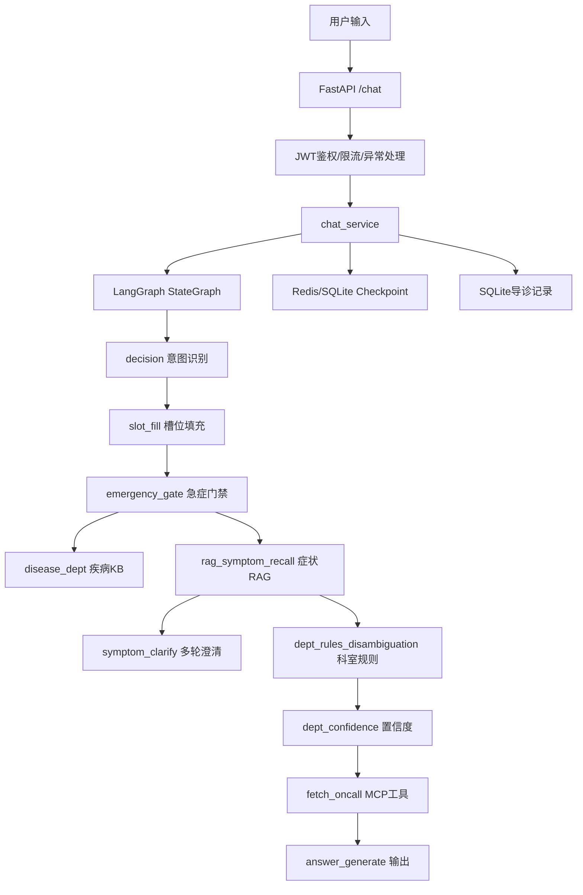

# 企业级Agent面试追问：医疗导诊项目回答稿

> 用途：回答面试官围绕“企业级 Agent 能力”的连续追问。  
> 主项目：医院导诊 Agentic 助手。  
> 技术栈：FastAPI、LangGraph、OpenSearch、Redis、SQLite、MCP、DashScope/OpenAI兼容接口、Docker、pytest。  
> 回答原则：只说项目里真实做过的；未落地的多 Agent、GraphRAG、OCR、微调，用“理解和扩展方案”回答。

---

## 0. 30秒总述

> 我这个项目解决的是医院导诊场景里“患者自然语言描述不标准、科室规则复杂、医疗风险高、人工分诊重复劳动大”的问题。  
> 
> 我没有把它做成普通知识库聊天机器人，而是用 FastAPI + LangGraph 搭了一个有状态的导诊 Agent。系统会先识别用户是疾病、症状还是无效输入，再做 NER、槽位填充、急症门禁、OpenSearch 混合 RAG、科室规则消歧、置信度判断，必要时通过 MCP 查询医院工具，最后生成安全导诊回答。  
> 
> 企业级能力主要体现在：状态可恢复、节点可追踪、低置信拒答、外部依赖可降级、测试和评估可回归。当前开源评测里 Batch100 综合通过 80/100，意图准确率 0.97，NER 准确率 0.81，项目内有 29 个 pytest 测试模块。

---

## 1. 项目真实性与业务理解

### 1.1 这个 Agent 解决了什么业务问题？

**回答**

> 它解决的是医院导诊前置分流问题。真实用户不会按标准医学术语描述病情，常见输入是“饭后胃胀反酸”“老人突然胸痛冒冷汗”“孩子发烧咳嗽”。人工导诊要反复询问症状、年龄、性别、部位，再判断科室和是否急诊。  
> 
> 这个 Agent 把这套人工流程工程化：先理解用户输入，再补齐必要信息，识别高风险急症，检索症状和疾病知识，结合科室规则推荐科室。它的边界是导诊，不是诊断，不给处方。

**不要说**

> 不要说“替代医生诊断”。医疗场景这样说很危险，面试官会直接追医疗合规。

### 1.2 为什么需要 Agent，而不是普通流程系统？

**回答**

> 如果用户只点选固定症状，普通流程系统就够了。但导诊输入是自然语言，而且存在多轮澄清、工具调用、状态恢复和低置信兜底。比如用户说“肚子不舒服”，系统需要判断是否要追问部位、年龄、伴随症状；用户下一轮回答后，还要接着上一轮状态继续，而不是重新开始。  
> 
> 所以这个场景需要 Agent 的状态管理、语义理解、工具调用和条件决策能力。但我没有让 Agent 完全自由行动，而是用 LangGraph 把它约束成可控状态机。

### 1.3 原来的人工流程是什么？

**回答**

```text
患者描述不舒服
→ 导诊台人工询问主诉、部位、年龄、性别、伴随症状
→ 判断是否急症
→ 根据医院科室规则推荐科室
→ 如果患者追问，再解释科室、值班、路线
```

系统化后：

```text
用户输入
→ decision / NER
→ slot_fill
→ emergency_gate
→ disease_kb 或 symptom RAG
→ dept_rules_disambiguation
→ dept_confidence
→ MCP 工具
→ answer_generate
```

### 1.4 使用 Agent 后提升了什么？

**回答口径**

> 当前开源项目重点验证的是链路可行性和评估闭环，不包装成真实医院上线收益。能量化的是工程评测指标：Batch100 综合通过 80/100，intent accuracy 0.97，NER accuracy 0.81；另外有多轮评估 summary 和 29 个 pytest 模块。  
> 
> 如果放到真实业务里，我会重点看四类指标：人工导诊接待量下降、平均导诊耗时下降、低风险问题自助完成率提升、急症提示漏检率下降。医疗场景不能只看回答率，安全指标更重要。

### 1.5 项目中的业务角色有哪些？

| 角色 | 作用 |
|---|---|
| 患者/用户 | 输入症状或疾病，获取科室建议 |
| 导诊台/客服 | 处理低置信、复杂或系统无法回答的问题 |
| 医生/科室专家 | 审核科室规则、急症规则、知识库内容 |
| 医院信息科/研发 | 维护系统、工具接口、日志、评估集 |
| Agent 系统 | 自动分流、追问、检索、推荐、兜底 |

面试可说：

> 患者端只消费经过规则和知识库约束后的结果；高风险或低置信场景转人工导诊台。医生不直接参与每轮对话，但应该参与知识库和规则审核。

---

## 2. 个人贡献边界

### 2.1 整个项目多少人开发？你负责哪部分？

**回答**

> 这个开源项目主要是我主导实现，用来展示医疗导诊 Agent 的工程能力。我负责整体架构、LangGraph 主图、RAG 检索、科室规则、MCP mock 工具、FastAPI 接口、JWT 网关、超时降级、评估脚本和测试。  
> 
> 如果在公司真实项目里，我一般会和产品、测试、前端、业务专家配合。业务专家负责确认医学规则和科室边界，测试负责补充验收样例，前端负责小程序或 Web 交互，我负责 Agent 后端链路和工程稳定性。

### 2.2 哪些代码是你写的？

可打开仓库讲这些：

| 能力 | 文件 |
|---|---|
| Agent 主图 | `app/graph/builder.py` |
| 状态模型 | `app/domain/models.py` |
| Chat 统一入口 | `app/services/chat_service.py` |
| LLM 主备 fallback | `app/core/llm.py` |
| 混合检索权重 | `app/infra/rag_hybrid_search.py` |
| OpenSearch RAG | `app/infra/opensearch_rag.py` |
| Checkpoint 降级 | `app/infra/redis_client.py` |
| MCP 客户端 | `app/mcp/client.py` |
| 科室置信度 | `app/graph/nodes/dept_confidence.py` |
| 急症门禁 | `app/graph/nodes/emergency_gate.py` |
| 评估结果 | `tests/results_batch100.json` |

### 2.3 哪些不是你项目里的强项？

**回答要诚实**

> 当前项目没有真正落地 AutoGen 多 Agent 协作，没有做 GraphRAG，没有做 OCR 多模态，也没有做 PyTorch/LoRA 微调。它的主线是 LangGraph 单 Agent 多节点状态机 + RAG + Tool + 稳定性工程。  
> 
> 我理解这些技术的适用场景，但不会把未落地内容包装成项目经验。

### 2.4 如果重新设计，你会改哪里？

**回答**

> 第一，我会把 LLM、embedding、OpenSearch 调用统一收敛到 resilience wrapper，加入 tenacity 指数退避、429 Retry-After、熔断和统一 fallback。  
> 
> 第二，我会把评估集从 100 条扩到更分层的 Golden Dataset，比如急症、妇儿、慢病、模糊主诉、无效输入分别统计。  
> 
> 第三，我会加强 RAG 数据治理，把 chunk、规则、疾病映射加版本号和审核人，形成知识库发布流程。  
> 
> 第四，如果做医生端后台，我会单独扩展医学证据研究 Agent，但不塞进患者端实时导诊主链路。

### 2.5 项目里最复杂的问题是什么？

**回答**

> 最复杂的不是接模型，而是如何让模型不要越界。导诊既要理解自然语言，又不能诊断和开药；既要尽量推荐科室，又不能低置信强答；既要支持多轮追问，又要避免脏状态。  
> 
> 我的解决方式是分层：规则处理急症和安全底线，RAG 处理知识召回，LangGraph 处理状态和流程，LLM 只处理局部语义任务，最后用评估集和 node trace 做回归。

---

## 3. Agent 架构设计问题

### 3.1 Agent 架构是什么？



### 3.2 为什么用 LangGraph？

**回答**

> 因为导诊不是简单链式调用，而是有状态、有分支、有多轮澄清、有急症抢占、有失败终止的业务流程。LangGraph 的显式 State、条件边和 Checkpoint 正好适合这类场景。  
> 
> 如果只是普通 FAQ，我不会上 LangGraph；Retriever + Prompt 就够了。但导诊需要可恢复、可追踪、可测试的状态机。

### 3.3 多 Agent 如何协作？你项目里用了多 Agent 吗？

**回答**

> 当前医疗导诊项目没有使用真正的多 Agent，它是单个 LangGraph 里的多节点状态机。节点可以调用不同模型、检索和工具，但不是多个自主 Agent 互相对话。  
> 
> 我这么选是因为导诊目标单一、实时性要求高、医疗风险高。多 Agent 会增加通信成本、仲裁复杂度、上下文膨胀和评估难度。  
> 
> 如果是医学证据研究、合同审核、财务方案评审，我会考虑多 Agent，比如 Planner、Retriever、Reviewer、Writer，由 Supervisor 管理共享状态。

### 3.4 Agent 之间如何通信？

如果被问多 Agent 方案，可以答：

> 我不会让 Agent 之间只传自然语言长文本，而是用共享任务状态和结构化消息。比如 `TaskState` 里保存 task_id、目标、当前阶段、证据卡片、工具结果、审核意见；每个 Agent 只读写自己负责的字段。  
> 
> 通信协议可以是 JSON Schema / Pydantic Model，事件写入数据库或消息队列，避免上下文爆炸。

示例：

```json
{
  "task_id": "case_001",
  "stage": "review",
  "evidence_cards": [],
  "tool_results": [],
  "review_comments": [],
  "status": "waiting_human"
}
```

### 3.5 如何避免上下文爆炸？

**回答**

> 第一，不把所有历史对话塞进 Prompt。第二，把长期状态结构化保存。第三，检索只取与当前节点相关的 top-k。第四，中间产物用 summary 或 evidence card，而不是全文传递。第五，多 Agent 场景下使用共享状态和引用 ID，而不是互相复制大段文本。

当前项目对应实现：

- `AppState` 保存结构化状态。
- `trim_history` 负责历史裁剪。
- RAG 只保留命中 chunk。
- 导诊记录落库用于审计，不直接全部进入下一轮 Prompt。

---

## 4. 失败路径设计

### 4.1 Agent 挂了怎么办？

**回答**

> 我会先区分是哪一层挂了：模型、embedding、OpenSearch、MCP 工具、Redis Checkpoint、数据库，还是业务节点异常。不同层降级方式不一样。  
> 
> 当前项目里，LLM 有主备 fallback；embedding 或 hybrid 检索失败会回退关键词；MCP 工具有 5 秒超时，失败只降级工具信息；整条 chat 有 60 秒超时兜底；低置信推荐会拒答或建议导诊台。

### 4.2 如何知道失败原因？

**回答**

> 每次请求会记录 node_trace，可以看到请求经过哪些节点。排查时我会按节点拆：decision/NER 是否错，RAG 是否召回错，科室规则是否错，置信度是否错，MCP 是否超时，回答生成是否越界。  
> 
> 企业级还应该记录 request_id、thread_id、node_name、耗时、入参摘要、出参摘要、异常堆栈、tool latency、token 和 fallback 次数。

### 4.3 如何恢复？是否支持断点续跑？

**回答**

> 多轮导诊通过 LangGraph Checkpoint 恢复状态。用户在澄清节点回答后，不是重新跑完整流程，而是根据 Checkpoint 里的 `clarify_state` 或 `dept_state` 继续。  
> 
> 当前项目支持会话级状态恢复，但不是复杂后台长任务的任意节点断点续跑。如果要做合同审核、医学证据研究这类长任务，我会增加 `agent_tasks` 和 `agent_events` 表，把每个节点执行状态持久化，支持从最近成功节点重放。

### 4.4 状态保存在哪里？

| 状态 | 存储 |
|---|---|
| LangGraph 对话状态 | RedisSaver / SqliteSaver / MemorySaver |
| 业务运行状态 | `AppState` |
| 会话线程元数据 | Redis / SessionManager |
| 完整导诊记录 | SQLite `triage_sessions` |
| 评估结果 | JSON / CSV exports |

### 4.5 LLM、OpenSearch、embedding 429 怎么办？

**当前项目真实情况**

> 当前项目已有 LLM fallback、OpenSearch fallback、MCP timeout、chat timeout，但统一 tenacity 指数退避还属于待补项。

**企业级答案**

```text
429 / timeout / 部分 5xx
→ 指数退避 + jitter
→ 遵守 Retry-After
→ 最大重试次数/最大总耗时
→ fallback model / keyword search / cached answer
→ 仍失败则返回固定兜底
```

兜底话术可以是：

> 系统繁忙，请前往导诊台。

---

## 5. 数据一致性问题

### 5.1 如果两个 Agent 同时修改一个订单状态怎么办？

虽然当前医疗导诊项目没有订单写操作，但可以用企业级方案回答：

> 高风险写操作不能让多个 Agent 直接写业务表。要用状态机和工具层做保护：每个订单状态迁移必须经过合法状态校验，写操作带幂等 key，数据库层使用事务或乐观锁，重复执行返回同一结果。  
> 
> 如果涉及跨系统，比如 ERP、支付、库存，我会优先使用事件表和 outbox pattern，保证本地状态和外部事件一致，失败后可重放。

### 5.2 导诊项目里怎么对应？

导诊项目主要是读多写少：

- 患者状态写入会话和导诊记录。
- MCP mock 主要查询值班、科室介绍、路线。
- 没有自动修改 HIS 业务状态。

回答：

> 当前项目没有让 Agent 自动写 HIS 核心业务数据，这是故意的。医疗场景高风险，查询类工具可以自动化，写操作必须加人工确认、幂等和审计。

---

## 6. RAG 企业级问题

### 6.1 你的 RAG 流程是什么？

**当前项目流程**

```text
用户问题
→ NER 抽取主症状/疾病
→ 疾病链：结构化 disease_kb 查询
→ 症状链：OpenSearch BM25 + kNN 混合召回
→ alias / alliance 精确命中重排
→ 科室规则消歧
→ 置信度评估
→ 回答生成
```

**说明**

> 当前项目不是典型“召回文档后让 LLM 总结答案”的知识库问答，而是 RAG + 规则 + 状态机组合。RAG 用来召回标准症状和候选科室，后续还要经过科室规则和置信度门禁。

### 6.2 为什么不用纯向量搜索？

**回答**

> 医疗导诊里有大量精确术语、疾病名和俗称。纯向量搜索可能语义相似但医学方向错，纯 BM25 又处理不了自然语言泛化。所以我用混合检索。项目里 BM25 权重 0.4，kNN 权重 0.6，BM25 字段对 `canonical_symptom`、`alliance`、`description`、`search_text` 做不同权重。

### 6.3 为什么需要 Reranker？

**回答**

> 召回阶段追求覆盖，排序阶段追求精度。比如“胸闷、心慌、走快了喘”，可能同时召回呼吸内科和心内科相关内容，后面需要结合部位、伴随症状、急症规则和科室规则做重排。  
> 
> 当前项目是规则重排和 alias 精确命中优先，后续如果数据规模更大，可以接 cross-encoder reranker 或 LLM rerank，但医疗实时链路要控制延迟。

### 6.4 Chunk 怎么切？

**当前项目**

> 当前知识库主要是结构化 JSONL，不是 PDF 长文档切片。症状知识、疾病 KB、科室规则天然带字段，例如标准症状、别名、描述、候选科室、消歧问题，所以不采用简单固定长度 chunk。

**如果扩展到企业文档**

> 我会按章节和语义切，而不是机械 500 字切。比如医学指南按疾病定义、诊断、治疗、禁忌、推荐意见切；合同按条款切；ERP 文档按模块、对象、接口切。小 chunk 用于召回，大 parent chunk 用于补上下文。

### 6.5 如何解决召回不到？

**回答**

> 先判断是 query 抽错、索引缺数据、同义词缺失，还是召回策略问题。我的处理顺序是：补充别名和俗称、优化 NER、调整 BM25/kNN 权重、增加 metadata filter、扩大 top-k、加入 bad case 到评估集。  
> 
> 当前项目里，如果 embedding 或 hybrid 检索失败，会 fallback 到关键词检索；如果仍召回不到，走 `rag_miss_reject`，不让模型凭空推荐。

### 6.6 如何减少幻觉？

**回答**

> 第一，业务边界写死：不诊断，不开药。第二，急症规则优先，不交给模型自由判断。第三，没有锁定科室时禁止自由生成。第四，低置信度拒答。第五，回答只基于状态机结果、RAG 结果和工具结果。第六，用评估集回归。  
> 
> 我认为减少幻觉不是靠一句 Prompt，而是靠数据、流程、规则、评估和兜底一起控制。

### 6.7 90% 准确率怎么算？

**回答**

> 我不会泛泛说“RAG 准确率 90%”。要拆指标。当前开源项目有 Batch100，统计了 passed、intent_accuracy、ner_accuracy。结果是 passed 80/100，intent accuracy 0.97，NER accuracy 0.81。  
> 
> exports 里还有多轮评估 summary，例如推荐率、科室相关性、整体成功率、NER accuracy。企业级评估还应该拆 Recall@k、科室推荐准确率、急症拦截率、拒答率、人工接管率。

### 6.8 测试集哪里来的？谁标注？

**回答**

> 当前开源项目测试集是围绕常见症状、疾病、妇儿、急症、模糊输入、无效输入构造的评估集，用来验证工程链路，不等同于真实医院标注集。  
> 
> 如果上线，我会要求医生或导诊专家参与标注，形成 Golden Dataset。标注标准至少包括：主症状、疾病名、期望科室、是否急症、是否应该拒答、是否需要追问、可接受科室范围。

---

## 7. 企业知识库 Agent 问题

### 7.1 知识库没有答案怎么办？

**回答**

> 不直接编。当前导诊项目里，如果 RAG 没命中或置信度不足，会走拒答或建议导诊台。医疗场景宁愿少答，也不能强答。  
> 
> 企业知识库也一样：知识库没有，就返回“当前资料未覆盖”，可以推荐相关文档或转人工，并记录这个 query 进入知识库补充队列。

### 7.2 权限控制怎么做？

当前项目已有 JWT 鉴权和用户维度限流，但医疗知识库没有复杂 ACL。企业级回答：

> 权限必须检索前过滤，不是生成后再删。用户登录后拿到 user_id、role、tenant、department 等权限字段，检索时把权限条件作为 metadata filter 加进去，禁止越权文档进入上下文。  
> 
> 生成后过滤只能作为第二道保险，不能作为主要权限控制。否则模型已经看到越权内容，风险已经发生。

企业 RAG 权限链路：

```text
JWT / SSO
→ 用户角色和租户
→ 文档 ACL metadata
→ 检索前 filter
→ 召回文档审计
→ 回答引用溯源
```

---

## 8. 工具调用问题

### 8.1 为什么不用 LLM 直接生成退款结果 / 值班结果？

**回答**

> 因为业务事实必须来自系统，不应该由模型编。比如退款状态、订单状态、医生值班、院内路线，这些都是实时业务数据，必须调用工具或数据库。LLM 只负责理解意图和组织表达，不能替代业务系统。

导诊项目对应：

> 值班预约、科室介绍、路线查询通过 MCP 工具获取，模型不能凭空编医生排班。

### 8.2 Tool 参数错误怎么办？

**回答**

> 工具调用前做 Schema 校验和业务前置条件校验。比如导诊项目里，只有科室已经锁定后才查值班，参数必须是合法科室名。参数不合法就不调用工具，返回澄清或降级。

### 8.3 API 失败怎么办？

**回答**

> 查询类工具失败时保留主回答，只降级工具结果；写操作失败时不能假装成功，要返回失败状态并允许重试。当前 MCP 默认 5 秒超时，失败会记录 `oncall_fetch_error`，回答里提示暂时无法获取值班信息。

### 8.4 如何防止误操作？

**回答**

> 工具分读写权限。读工具可以自动执行，写工具必须 human-in-the-loop。写操作要有幂等 key、参数确认页、权限校验、审计日志和回滚方案。医疗导诊项目当前没有自动写 HIS，这也是风险控制。

---

## 9. 状态管理问题

### 9.1 对话历史存哪里？

**回答**

> 多轮对话状态通过 LangGraph Checkpoint 保存，底层优先 RedisSaver，不可用时可回退 SqliteSaver，再失败回退 MemorySaver。完整导诊记录另外写 SQLite，用于审计和评估。  
> 
> 这样短期运行状态和长期业务记录是分开的。

### 9.2 长对话如何处理？

**回答**

> 长对话不能无限塞进 Prompt。当前项目有 `trim_history` 节点，保留必要消息，同时把关键业务信息放在结构化 AppState 里，例如槽位、候选科室、置信度和工具结果。  
> 
> 更长任务会用摘要、阶段性产物和引用 ID 管理上下文。

### 9.3 用户第二天回来还能继续吗？

**回答**

> 取决于业务设计。如果保留 thread_id 和 Checkpoint，理论上可以继续。但导诊场景有时效性，症状变化很快，所以不建议无限期延续旧导诊状态。  
> 
> 企业级设计会给 Checkpoint 设置 TTL，第二天回来可以展示历史记录，但是否继续旧流程要看业务规则，必要时重新确认症状。

---

## 10. 生产部署问题

### 10.1 QPS、延迟、P95 怎么回答？

**谨慎口径**

> 当前开源项目主要用于本地演示和工程链路验证，没有真实线上 QPS 数据。我不会把未验证的压测数字写死。  
> 
> 如果上线，我会按节点拆性能：API 网关、LLM、embedding、OpenSearch、MCP、Checkpoint、DB，每个节点记录 p50/p95/p99 和错误率。优化时先看瓶颈，不盲目换模型。

### 10.2 如何优化性能？

可说：

- 能用规则和结构化 KB 解决的，不调用 LLM。
- 工具列表缓存。
- 高频 query / 检索结果缓存。
- 控制 top-k 和 Prompt 长度。
- 外部 I/O 设置 timeout。
- 批量 embedding 和离线入库。
- 本地模型可用 vLLM、prefix caching、chunked prefill。

### 10.3 LLM 接口挂了怎么办？

**回答**

> 当前项目封装了 `FallbackChatModel`，主模型失败时切换备用模型，支持 invoke、ainvoke 和 structured_output。生产上还要加指数退避、熔断、错误分类和固定兜底话术。  
> 
> 对医疗导诊来说，如果模型整体不可用，宁愿返回“系统繁忙，请前往导诊台”，也不能编一个不可靠建议。

### 10.4 第三方 API 不可用怎么办？

**回答**

> 分清主链路和增强链路。导诊推荐是主链路，值班和路线是增强链路。MCP 查询失败时，只降级增强信息，不影响已完成的科室推荐。  
> 
> 如果主链路依赖不可用，比如 OpenSearch 不可用，则走本地 KB 或关键词 fallback；仍不可用则拒答或转人工。

---

## 11. 监控与评估

### 11.1 如何知道 Agent 变差了？

**回答**

> 要有离线 Golden Dataset 和线上监控两套。离线看固定评估集是否退化；线上看 fallback 率、拒答率、人工接管率、用户负反馈、工具失败率、延迟和成本。  
> 
> 如果某次更新后 NER accuracy 或推荐成功率下降，就不能上线。

### 11.2 如何发现错误回答？

**回答**

> 一是人工抽检和用户反馈，二是规则检测，比如是否出现诊断、处方、绝对化承诺，三是用评估脚本批量跑历史 bad case。导诊项目有 node_trace，可以把错误归因到具体节点。

### 11.3 如何回归测试？

当前项目：

- 29 个 pytest 模块。
- `tests/results_batch100.json`。
- `tests/run_eval.py`。
- `exports/medical_small_100_eval_summary_v*.json`。

回答：

> 每次改 Prompt、规则、RAG 数据或节点逻辑，都要跑相关 pytest 和 batch eval。只要医疗安全和科室推荐指标下降，就要回滚或继续修 bad case。

---

## 12. 20个核心问题逐题短答

### 1. 为什么这个业务需要 Agent？

> 因为患者输入是自然语言，流程有多轮澄清、急症判断、知识检索、工具调用和状态恢复。普通固定流程难以覆盖这些动态决策。

### 2. 业务流程是什么？

> 用户输入后，系统做意图识别、实体抽取、槽位填充、急症门禁、疾病 KB 或症状 RAG、科室规则消歧、置信度门禁、MCP 工具调用和最终回答。

### 3. 你负责哪部分？

> 我负责后端主链路：FastAPI 接口、LangGraph 编排、RAG、科室规则、MCP mock、状态持久化、降级策略、评估脚本和测试。

### 4. Agent 架构是什么？

> FastAPI 网关 + chat_service + LangGraph StateGraph + OpenSearch RAG + Redis/SQLite Checkpoint + MCP 工具 + SQLite 记录 + pytest/eval。

### 5. 为什么这么设计？

> 医疗导诊要可控、可测、可追踪，不能只靠 Prompt。状态机控制流程，RAG 提供知识，规则兜住安全底线，LLM 做局部语义理解。

### 6. 多 Agent 如何协作？

> 当前项目没有真正多 Agent。多 Agent 我会用 Supervisor + Specialist，通过结构化 TaskState 通信，适合医学证据研究、合同审核等后台长任务。

### 7. Agent 失败怎么办？

> 先定位失败层：LLM、RAG、工具、Checkpoint 或业务节点。当前项目有 LLM fallback、RAG fallback、MCP timeout、chat timeout、低置信拒答。

### 8. 状态如何保存？

> 运行状态在 AppState，短期对话在 LangGraph Checkpoint，完整导诊记录在 SQLite。

### 9. 如何恢复任务？

> 多轮澄清通过 thread_id + Checkpoint 恢复。长任务场景要扩展 task/event 表，支持从最近成功节点重放。

### 10. 如何保证数据一致性？

> 当前项目没有自动写 HIS。企业写操作要用状态机、事务、乐观锁、幂等 key、审计日志和人工确认。

### 11. RAG 准确率怎么算？

> 不笼统说 RAG 准确率。拆成 intent、NER、Recall@k、科室推荐、急症拦截、整体成功率。当前 Batch100 是 passed 80/100，intent 0.97，NER 0.81。

### 12. 测试集哪里来的？

> 当前是围绕常见导诊场景构造的开源评估集。真实上线要由医生/导诊专家标注 Golden Dataset。

### 13. 如何减少幻觉？

> 不让模型自由诊断；急症规则优先；无锁定科室不生成；低置信拒答；回答基于 RAG、规则和工具结果；持续回归测试。

### 14. 如何做权限控制？

> 当前项目有 JWT 鉴权。企业知识库要检索前按用户角色、租户、部门做 metadata filter，不能生成后再过滤。

### 15. Tool 调用失败怎么办？

> 查询类工具失败就降级增强信息，写操作失败必须返回失败并可重试。当前 MCP 有 5 秒超时和错误字段。

### 16. 如何人工接管？

> 低置信、急症、高风险、超时、知识库未覆盖都可以转导诊台。系统返回固定兜底，并记录状态和原因。

### 17. 如何监控 Agent？

> 监控请求量、p95/p99、LLM 错误率、fallback 率、RAG 召回率、工具失败率、低置信拒答率、人工接管率和用户反馈。

### 18. 如何评估线上效果？

> 离线 Golden Dataset + 线上反馈闭环。看任务完成率、错误率、人工接管率、急症漏检率、延迟和成本。

### 19. 如何优化性能？

> 减少不必要 LLM 调用；结构化 KB 优先；缓存工具列表和检索结果；控制 top-k；外部 I/O 超时；离线 embedding；必要时用 vLLM。

### 20. 上线后遇到最大问题是什么？

> 最大问题通常不是模型不会答，而是 bad case 难归因。我的处理方式是保留 node_trace，把问题拆到 NER、召回、规则、置信度、工具或回答生成层，再修对应模块并加入回归集。

---

## 13. 最适合面试结尾的一句话

> 我理解企业级 Agent 的分水岭不是能不能跑一个 Demo，而是失败路径有没有设计、状态能不能恢复、工具调用是否可控、RAG 是否可评估、线上问题能不能定位。我的医疗导诊项目就是按这个方向做的：用 LangGraph 把业务流程显式化，用 RAG 和规则约束模型，用 Checkpoint 和日志保证可追踪，用评估集保证持续迭代。

