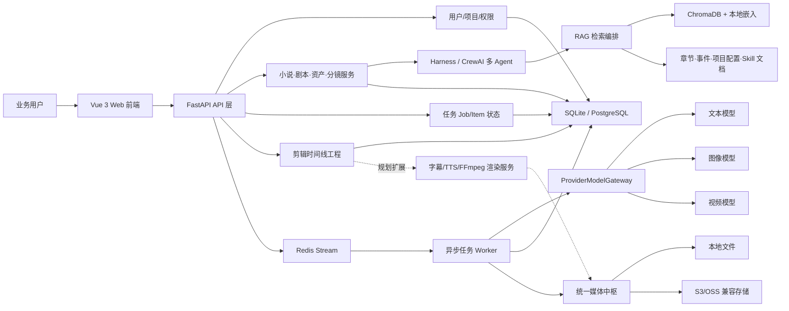
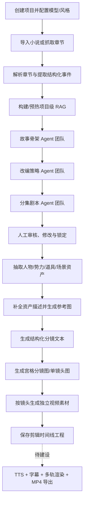
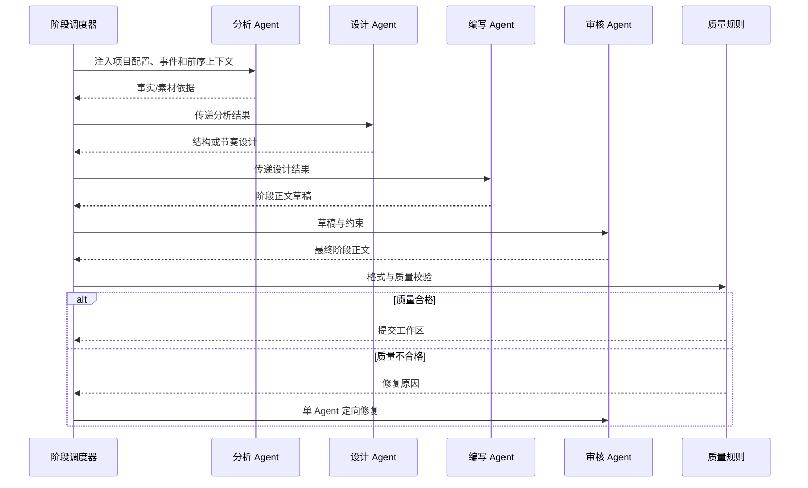
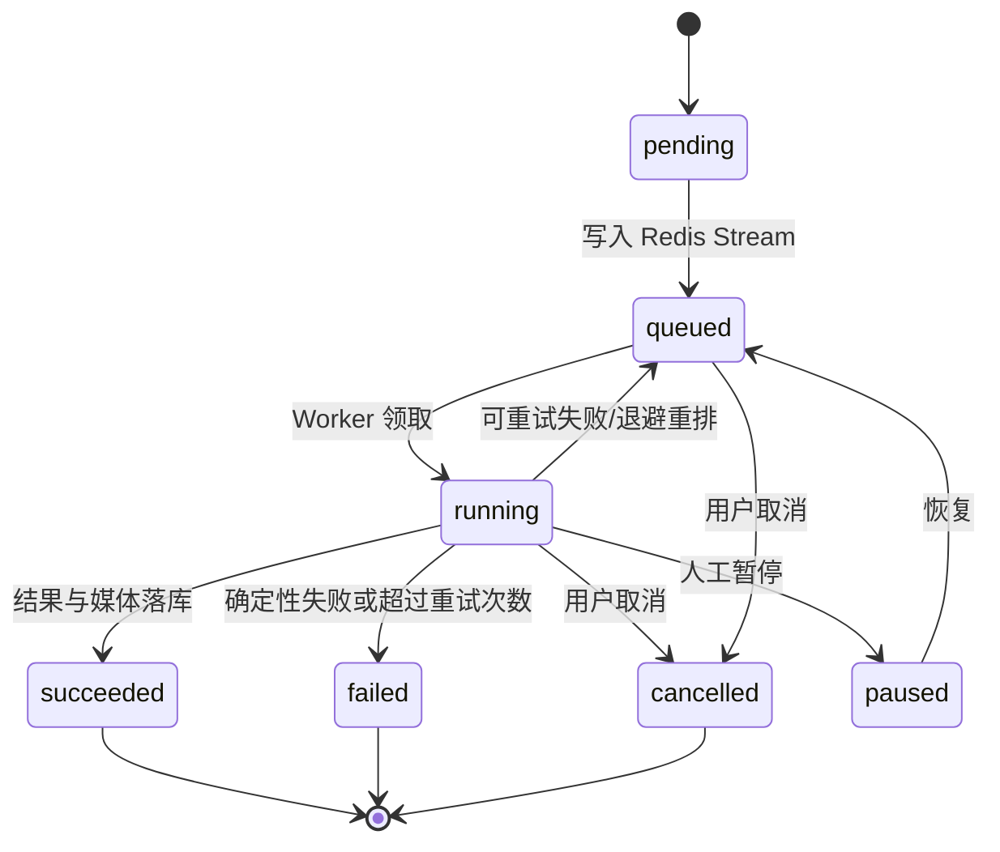
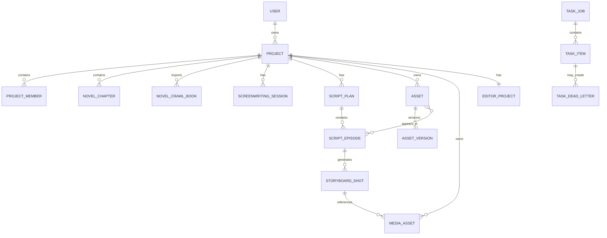
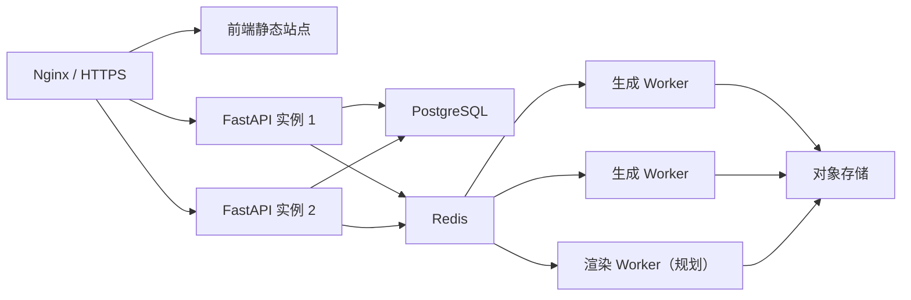

# 小说转短剧 AI 内容生产平台——软件设计说明书（SDD）

| 文档属性 | 内容 |
|---|---|
| 文档版本 | v1.0 |
| 基线日期 | 2026-08-07 |
| 项目目录 | `E:\novelTovideo` |
| 适用对象 | 产品经理、业务人员、AI 应用工程师、后端/前端工程师、测试与运维人员 |
| 文档性质 | 基于当前代码的现状设计说明，同时给出生产化目标设计 |

> 本文严格区分“代码已具备”“部分具备”和“规划建设”。当前代码已经覆盖小说导入、剧本创作、多 Agent 协作、RAG、资产抽取、分镜与媒体生成任务；具备单镜头视频生成入口和剪辑时间线工程，但尚未形成 TTS、字幕、真实时间线渲染及 FFmpeg 最终成片导出的完整闭环。

## 1. 文档目的

本文描述小说转短剧 AI 内容生产平台的软件设计，包括业务目标、功能范围、总体架构、核心业务流程、多 Agent 与 RAG 设计、异步任务、数据模型、接口边界、安全、部署、测试和演进路线。

文档主要解决以下问题：

1. 说明平台解决什么业务需求，以及当前能力边界。
2. 说明为什么采用阶段化多 Agent，而不是一次大模型调用。
3. 说明小说、剧本、资产、分镜和媒体数据如何流转。
4. 说明模型调用、异步任务、重试和媒体存储如何解耦。
5. 给后续补齐 TTS、字幕、视频合成和生产化能力提供设计基线。

## 2. 项目概述

### 2.1 业务背景

传统小说改编短剧需要编剧、导演、分镜师和后期人员协作，存在原文体量大、改编周期长、内容一致性难保证、镜头素材生产成本高等问题。平台通过结构化工作流，将长篇小说逐步加工为可拍摄、可生成的视频素材，降低重复劳动并保留人工审核点。

### 2.2 目标用户

| 用户角色 | 主要诉求 |
|---|---|
| 内容策划/编剧 | 快速完成故事骨架、改编策略和分集剧本 |
| 导演/分镜师 | 将剧本转换为结构化镜头并控制视觉与导演风格 |
| AI 制作人员 | 批量生成角色、场景、分镜图和镜头视频 |
| 运营/项目经理 | 查看任务进度、失败原因、成本和产出状态 |
| 系统管理员 | 管理用户、模型 Provider、权限和运行配置 |

### 2.3 业务目标

- 支持小说文件、章节数据或配置化内容源导入。
- 从小说中提取章节事件，并形成可检索的创作知识上下文。
- 通过阶段化多 Agent 完成故事骨架、改编策略和分集剧本。
- 抽取人物、势力、道具、场景等可复用资产，并维护版本和关系。
- 从剧本生成结构化分镜、宫格分镜图和单镜头图。
- 按镜头生成独立视频素材，统一管理图片、视频和音频资产。
- 通过异步任务系统承载耗时模型调用，支持重试、心跳和死信记录。
- 为后续 TTS、字幕、时间线渲染和最终成片导出提供扩展基础。

### 2.4 非目标

当前版本不以以下能力为交付目标：

- 自研或训练基础大模型、图像模型、视频模型。
- 替代剪映、Premiere 等专业非线性剪辑软件。
- 自动完成版权审核、内容发行和平台发布。
- 无人工审核地直接生产商业成片。
- 在当前代码状态下承诺完整 TTS、字幕烧录和 FFmpeg 成片导出。

## 3. 当前能力边界

| 能力 | 状态 | 说明 |
|---|---|---|
| 用户登录与 JWT 鉴权 | 已具备 | 用户、Token、项目访问控制代码已存在 |
| 项目与模型配置 | 已具备 | 支持文本、图像、视频、TTS 模型字段及视觉参数 |
| 小说导入与内容源配置 | 已具备 | 支持章节导入、API/规则型来源、搜索与抓取相关服务 |
| 章节事件提取 | 已具备 | 将章节正文转换为结构化事件，供创作和 RAG 使用 |
| 多 Agent 剧本创作 | 已具备 | 故事骨架、改编策略、剧本三个阶段按依赖顺序执行 |
| RAG | 已具备 | 项目级隔离，支持章节、事件、项目配置和技能文档检索 |
| 剧本同步、版本和锁定 | 已具备 | 剧本计划、分集正文、版本号和人工锁定字段已存在 |
| 资产抽取和资产关系 | 已具备 | 人物、势力、道具、场景，支持关系、分集关联和版本快照 |
| 分镜文本 | 已具备 | 结构化镜头包含景别、运镜、动作、对白、时长和提示词 |
| 宫格分镜图与单镜头图 | 已具备 | 支持异步批量生成及媒体回写 |
| 单镜头视频生成 | 代码具备 | 支持首帧、尾帧、多参考图和异步视频 Provider；需配置可用视频模型 |
| TTS | 部分具备 | 项目与 Provider 类型已预留，部分 Provider 仍为未实现方法 |
| 剪辑时间线工程 | 部分具备 | 服务端只校验并保存时间线 JSON、总时长、比例和名称 |
| 多镜头自动拼接 | 未具备 | 未发现实际的视频拼接渲染实现 |
| 字幕生成与烧录 | 未具备 | 未形成 SRT/ASS 生成、对齐和烧录链路 |
| FFmpeg 最终成片导出 | 未具备 | 未发现 FFmpeg/ffprobe 调用和成片导出任务 |

## 4. 总体架构



### 4.1 架构分层

| 层次 | 主要职责 | 当前技术 |
|---|---|---|
| 表现层 | 项目、小说、剧本、制作、任务和编辑器页面 | Vue 3、TypeScript、Element Plus、Vue Router、Axios、Vite |
| 接口层 | 鉴权、参数校验、HTTP API 和异常映射 | FastAPI、Pydantic/SQLModel Schema |
| 业务层 | 小说、剧本、资产、分镜、媒体和剪辑工程逻辑 | Python Service 模块 |
| Agent 层 | 阶段规划、角色协作、工具调用、质量校验和修复 | Harness、CrewAI、DeepAgents/LangGraph 相关能力 |
| RAG 层 | 文档构建、切片、意图识别、混合检索和项目隔离 | ChromaDB、ONNX Runtime、本地嵌入模型 |
| 任务层 | 长任务入队、消费、重试、超时、心跳和死信 | Redis Stream、独立 Worker、数据库任务表 |
| 模型适配层 | 统一文本、图像、视频 Provider 调用 | ProviderModelGateway、HTTPX、模型适配器 |
| 数据层 | 业务事实、任务状态、版本和会话持久化 | SQLite（本地）/PostgreSQL（生产建议）、SQLModel、Alembic |
| 媒体层 | 图片、视频、音频元数据和文件存储 | 本地文件系统或 S3/OSS 兼容存储 |

### 4.2 关键设计原则

1. **阶段化而非一次生成**：长小说不直接一次生成完整短剧，先固化骨架和策略，再逐集生成剧本。
2. **数据库为事实源**：Redis Stream 用于调度，任务真实状态保存在数据库。
3. **生成与业务解耦**：模型 Provider 通过统一网关接入，业务服务不直接依赖单一厂商协议。
4. **媒体统一建模**：图片、视频、音频统一进入媒体中枢，以 `media_public_id` 被资产、镜头、轨道和项目引用。
5. **人工可锁定**：剧本、资产、分镜均保留人工编辑或锁定点，避免重新生成覆盖已确认内容。
6. **失败可恢复**：耗时任务支持超时、重试、心跳、失联回收和死信记录。

## 5. 核心业务流程

### 5.1 端到端流程



### 5.2 小说导入流程

小说数据可以来自本地导入、已配置 API 来源或规则型抓取来源。导入服务负责章节排序、正文清洗、来源标识、章节 MD5 和错误记录。对于外部来源，系统应遵守站点服务条款和版权要求，不应将绕过访问控制作为平台能力。

建议的幂等键：

```text
project_id + source_key + source_book_id + source_chapter_id
```

同一来源章节重复导入时，通过来源 ID 或正文 MD5 判断新增、更新或跳过。

### 5.3 剧本创作流程

创作阶段固定为：

```text
skeleton（故事骨架）
  → strategy（改编策略）
  → script（分集剧本）
```

后续阶段不能绕过前置阶段。每一阶段均使用已确认的项目配置、章节事件、前序工作区和 RAG 上下文。剧本阶段按集生成，减少长上下文溢出和单次失败影响范围。

### 5.4 资产与分镜流程

剧本同步入库后，从分集正文抽取以下资产：

- `role`：人物；
- `faction`：势力/组织；
- `prop`：道具；
- `scene`：场景。

资产可与分集关联，也可建立 `child_of`、`derivative_of`、`uses`、`appears_with`、`belongs_to` 等关系。资产锁定后，后续重新抽取不能直接覆盖人工确认内容。

分镜镜头包含场号、镜头序号、景别、机位与运镜、画面动作、对白、时长、引用资产、正负提示词、首尾帧和状态。镜头生成后可继续生成宫格图、单帧图和独立视频素材。

### 5.5 视频与剪辑流程边界

当前视频生成以“一个镜头对应一个或多个候选视频素材”为基本粒度。代码支持根据项目模式选择首帧、尾帧或多参考图，并通过异步 Provider 提交和轮询视频任务。

当前剪辑模块只保存：

- 时间线 JSON；
- 工程名称；
- 总时长；
- 画幅比例；
- 时间线中的媒体引用关系。

服务端没有解释时间线内部结构，也没有执行裁剪、拼接、转场、混音、字幕烧录或成片渲染。因此“编辑器工程”不能等同于“完整在线剪辑台”。

## 6. 多 Agent 设计

### 6.1 为什么使用多 Agent

单次模型调用难以同时满足长文本理解、改编取舍、商业节奏、剧本格式和质量审核。系统将任务拆成可验证的角色产物，使每一步有明确输入、输出和失败边界。

多 Agent 的主要价值：

- 分离事实提取、结构设计、正文编写和质量审核职责；
- 降低长上下文中指令互相干扰；
- 支持阶段级重试，而不是整条链路全部重跑；
- 允许人工在骨架、策略和剧本之间确认或修改；
- 便于分别评测事实一致性、结构质量和格式正确性。

### 6.2 调度方式

该项目的多 Agent 以**顺序协作**为主，不是无约束并发群聊：



`SCREENWRITING_STAGE_TEAM_ENABLED` 控制是否启用阶段团队；关闭时回退为单 Agent。当前质量失败的阶段自修复上限由代码常量控制，默认最多尝试 2 次。

### 6.3 阶段团队

| 阶段 | 典型角色 | 最终产物 |
|---|---|---|
| 故事骨架 | 事件分析、结构设计、分集卡点、总稿审核 | 故事核心、人物弧、三幕结构、分集节奏 |
| 改编策略 | 素材审读、取舍策略、总稿审核 | 保留/删除/压缩/合并规则及平台策略 |
| 分集剧本 | 衔接分析、场景节奏、正文编写、格式审核 | 可同步入库的分集 Markdown 剧本 |

### 6.4 Agent 工具与状态

Agent 工具包括：

- 查询 RAG 上下文；
- 获取项目创作配置；
- 获取当前工作区；
- 获取章节事件；
- 在允许范围内更新创作配置。

会话按“项目 + 用户”隔离，保存活动页签、骨架、策略、剧本、对话消息、历史快照和工作流 JSON。数据库行为事实源，便于多 Worker 或服务重启后恢复。

### 6.5 人工审核点

- 项目创作配置确认；
- 故事骨架确认；
- 改编策略确认；
- 分集剧本编辑和锁定；
- 资产描述、资产关系和参考图确认；
- 分镜镜头和正式分镜图锁定；
- 候选视频选择；
- 最终剪辑与发布确认（规划）。

## 7. RAG 设计

### 7.1 知识来源

项目级 RAG 文档由以下内容构成：

- 项目基本配置；
- 小说基本信息；
- 章节正文；
- 结构化章节事件；
- 视觉风格 Skill；
- 导演手册和创作 Skill。

### 7.2 索引隔离

每个项目使用独立隔离键和向量存储目录，避免不同项目之间召回串线。索引通过文档指纹判断是否过期，并支持后台预热、增量写入和旧切片清理。

### 7.3 检索策略

检索优先级按查询意图动态选择：

1. 项目或字段元数据精确匹配；
2. 结构化事件 JSON 匹配；
3. 章节正文定位；
4. 向量语义检索；
5. 词法检索兜底。

RAG 失败时不阻断主对话链路，而是返回空上下文和失败原因；关键生成任务仍应在质量校验阶段检查事实依据是否充分。

## 8. Provider 与模型调用设计

### 8.1 统一网关

`ProviderModelGateway` 对上层提供统一能力：

- `generate_text`：文本生成；
- `generate_stream`：流式文本生成；
- `generate_image`：图片生成；
- `generate_video`：视频生成。

Provider 负责厂商鉴权、请求格式、异步任务轮询和原始响应解析，网关将结果归一化为业务可处理的数据结构。

### 8.2 当前适配情况

- 文本模型支持 OpenAI 兼容型调用方式。
- Qwen 图像模型通过 DashScope 原生多模态生成接口适配。
- 视频生成支持异步提交、轮询和结果下载，已有火山方舟/Seedance 类 Provider 运行时设计。
- TTS 虽然出现在项目模型配置和 Provider 类型中，但不能据此认定完整语音生产链路已经实现。

### 8.3 Provider 约束

- API Key 只能从环境变量或安全密钥服务读取，不得写入代码、日志或 SDD。
- 请求必须设置连接、读取和总任务超时。
- 视频等异步 API 必须处理提交成功但轮询失败的中间状态。
- 厂商返回 URL 应下载并转存到自有媒体存储，避免临时 URL 过期。
- 模型错误需标准化为可重试和不可重试两类。

## 9. 异步任务系统

### 9.1 设计目标

图片、视频、事件抽取和资产生成均可能耗时数十秒到数分钟，不能占用同步 HTTP 请求。系统使用数据库任务表记录状态，使用 Redis Stream 进行消息通知和 Worker 调度。

### 9.2 数据模型

- `TaskJob`：一次批量任务，如一集 13 个镜头的分镜图生成。
- `TaskItem`：可独立执行和重试的最小子任务。
- `TaskDeadLetter`：超过重试次数或无法恢复的失败记录。

### 9.3 状态机



Job 根据子项汇总为 `succeeded`、`failed`、`partial` 或 `cancelled`。

### 9.4 可靠性设计

- Job 和 Item 支持幂等键，避免重复提交重复产出。
- Worker 使用消费者组读取 Stream。
- 子任务执行时定期更新心跳。
- 失联扫描器回收长时间无心跳的 `running` 任务。
- 可重试错误按退避时间重新排队。
- 不可重试错误直接失败并保存标准错误码。
- 超过最大尝试次数写入死信表，保留输入、输出和错误信息。
- Worker 优雅退出时停止领取新任务，并等待当前任务完成或超时。

## 10. 数据设计

### 10.1 核心实体关系



### 10.2 主要表

| 表 | 用途 | 关键约束 |
|---|---|---|
| `af_user` | 用户与身份信息 | 用户公开 ID 唯一 |
| `af_project` | 项目配置和默认模型 | 项目归属 owner |
| `af_project_member` | 项目成员与角色 | 项目内用户唯一 |
| `af_novel_chapter` | 小说章节与事件 | 项目、章节序号索引 |
| `af_novel_crawl_source` | 外部内容源配置 | source key 唯一 |
| `af_novel_crawl_book` | 导入小说元数据 | 来源小说身份唯一化 |
| `af_screenwriting_session` | Agent 会话和工作区 | 项目 + 用户隔离键唯一 |
| `af_script_plan` | 剧本计划 | 来源会话隔离键唯一 |
| `af_script_episode` | 分集剧本 | 计划 + 集号唯一 |
| `af_asset` | 人物、势力、道具、场景 | 项目 + 用户 + 类型 + 名称唯一 |
| `af_asset_relation` | 资产关系 | 起点 + 终点 + 关系类型唯一 |
| `af_asset_episode` | 资产与分集关联 | 资产 + 分集唯一 |
| `af_asset_version` | 资产版本快照 | 资产 + 版本号唯一 |
| `af_storyboard_shot` | 结构化分镜镜头 | 项目 + 用户 + 分集 + 镜头序号唯一 |
| `af_media_asset` | 统一图片/视频/音频中枢 | 通过 scope 和 public ID 关联业务对象 |
| `af_editor_project` | 时间线工程 | 一个项目一份工程 |
| `af_task_job` | 批量任务 | 支持幂等键和汇总状态 |
| `af_task_item` | 任务子项 | Job + item_key 唯一 |
| `af_task_dead_letter` | 死信记录 | 保存不可恢复任务上下文 |

### 10.3 媒体状态

```text
pending → processing → ready
                     ↘ failed
```

媒体元数据记录类型、来源、用途、Provider、模型、提示词、参数、种子、存储位置、尺寸、时长、用量以及关联任务。业务对象只持有媒体公开 ID，避免分别维护多套图片和视频表。

### 10.4 一致性要求

数据库事务不能回滚文件系统或对象存储操作，媒体写入采用以下顺序：

1. 创建 `processing` 媒体行并提交或刷新；
2. 调用模型并获取内容；
3. 写入临时文件或临时对象；
4. 原子移动/确认上传完成；
5. 更新媒体行为 `ready`；
6. 失败时更新为 `failed` 并记录原因；
7. 定时对账清理孤儿文件和长期 `processing` 记录。

## 11. API 设计

统一前缀默认为 `/api`，健康检查为 `/api/health`。主要路由组如下：

| 路由组 | 责任 |
|---|---|
| `/users` | 登录、Token、用户资料和用户管理 |
| `/projects` | 项目 CRUD、成员、模型与风格配置 |
| `/providers` | Provider 配置、模型列表与连通性 |
| `/projects/{project_id}/novels` | 小说来源、搜索、导入、章节与事件处理 |
| `/projects/{project_id}/novels/screenwriting` | Agent 会话、流式创作、工作区和质量评估 |
| `/projects/{project_id}/scripts` | 剧本同步、分集编辑、锁定和删除 |
| `/projects/{project_id}/assets` | 资产抽取、编辑、版本、关系和资产生图 |
| `/projects/{project_id}/storyboards` | 分镜生成、镜头编辑、分镜图和视频任务 |
| `/projects/{project_id}/media` | 媒体查询、上传、内容读取、选择和禁用 |
| `/projects/{project_id}/editor` | 获取和保存剪辑工程时间线 |
| `/tasks`、`/projects/{project_id}/tasks` | 任务查询、取消、恢复、重试和死信管理 |

### 11.1 异步任务接口约定

提交接口只负责校验、创建 Job/Item 并入队，不等待模型完成。建议响应结构：

```json
{
  "jobPublicId": "uuid",
  "status": "queued",
  "totalItems": 4
}
```

任务详情至少返回总数、成功数、失败数、子项状态、错误码和关联媒体 ID。前端采用自适应轮询，在任务进入终态后停止请求。

### 11.2 错误分类

| 分类 | 示例 | 是否重试 |
|---|---|---|
| 参数/前置状态错误 | 未绑定模型、未生成分镜图、剧本未锁定 | 否 |
| 权限错误 | 无项目访问权限、Token 失效 | 否 |
| Provider 限流 | 429、厂商队列拥堵 | 是，退避 |
| 网络或临时服务错误 | 连接中断、5xx | 是 |
| 内容安全拒绝 | 模型安全策略拒绝 | 通常否，需人工修改输入 |
| 媒体存储失败 | 上传超时、临时 URL 失效 | 视错误类型决定 |

## 12. 前端设计

### 12.1 技术栈

- Vue 3；
- TypeScript；
- Vite；
- Element Plus；
- Vue Router；
- Axios。

### 12.2 页面信息架构

路由设计包含登录、项目、小说、原文、剧本创作、剧本、任务、制作和编辑器页面。Token 当前通过浏览器本地存储读取，生产环境应进一步评估 XSS 风险，并考虑 HttpOnly Cookie 或更严格的 CSP。

### 12.3 当前源码风险

当前本地副本包含已构建的 `dist` 和依赖目录，但前端源码目录不完整：路由引用的多个页面文件及 `package.json` 未出现在当前源码快照中。该问题不影响已构建页面运行，但会影响可重复构建、版本升级和团队维护，应列为 P0 修复项。

### 12.4 编辑器边界

前端可以构造并保存时间线 JSON；后端不解释其轨道和片段内容。若要成为真正在线剪辑台，需要补充：

- 视频/音频/字幕多轨 UI；
- 拖拽排序、裁剪、分割、转场和音量控制；
- 时间线 Schema 版本管理；
- 浏览器预览或代理低码率素材；
- 服务端渲染任务；
- 导出进度、失败恢复和最终媒体回写。

## 13. 最终成片扩展设计

### 13.1 目标链路

```text
镜头视频选择
→ 台词拆分和角色声线映射
→ TTS 音频生成
→ 字幕时间轴生成（SRT/ASS）
→ 时间线组装
→ FFmpeg 渲染
→ 质检
→ 最终 MP4 写入媒体中枢
```

### 13.2 建议新增服务

| 服务 | 职责 |
|---|---|
| VoiceService | 角色声线、TTS 请求、音频标准化和缓存 |
| SubtitleService | 台词切分、时间对齐、SRT/ASS 生成 |
| TimelineService | 校验轨道、片段、入出点、转场和媒体引用 |
| RenderService | 生成 FFmpeg filter graph 并执行渲染 |
| QualityService | 检测黑帧、静音、时长偏差、分辨率和音画不同步 |

### 13.3 时间线最小 Schema

```json
{
  "schemaVersion": 1,
  "ratio": "9:16",
  "fps": 25,
  "tracks": [
    {
      "type": "video",
      "clips": [
        {
          "mediaPublicId": "uuid",
          "timelineStartMs": 0,
          "sourceInMs": 0,
          "sourceOutMs": 5000
        }
      ]
    }
  ]
}
```

后端必须校验所有媒体属于当前项目、处于 `ready` 状态，且入出点不越界。渲染任务应使用独立队列，防止 CPU 密集型 FFmpeg 任务阻塞模型任务 Worker。

## 14. 安全设计

### 14.1 身份与权限

- JWT 访问 Token 和刷新 Token 分离；
- 密码使用 bcrypt 哈希；
- 所有项目路由校验项目成员身份和角色；
- 管理 Provider、用户和系统配置的接口仅管理员可访问；
- 媒体内容接口必须校验项目访问权限，不能只依赖公开 ID 难猜。

### 14.2 密钥管理

- API Key、数据库密码、对象存储密钥只能通过环境变量或密钥管理服务注入；
- 日志必须对 Authorization、Cookie、API Key 和签名 URL 脱敏；
- 当前配置源码中存在疑似敏感默认值，发布前必须删除硬编码、轮换相关凭据并进行仓库历史扫描；
- `.env` 不得提交版本库，需提供无真实值的 `.env.example`。

### 14.3 内容源安全

配置化小说来源会引入 SSRF、恶意重定向和超大响应风险，应实施：

- 协议限制为 HTTP/HTTPS；
- 域名白名单或管理员审批；
- 阻止访问本机、内网、云元数据地址；
- 限制重定向次数、响应体大小和请求时间；
- 对 Cookie、请求头和脚本配置进行权限隔离；
- 保存来源和版权授权记录。

### 14.4 AI 安全

- 小说正文和 RAG 文档按不可信数据处理，使用明确边界包裹，防止提示注入；
- Agent 工具采用白名单和参数 Schema，不允许模型执行任意代码或任意网络请求；
- 模型输出进入数据库前执行结构、长度和内容安全校验；
- 高成本视频任务增加配额、预算确认和人工审批；
- 保留提示词、模型版本、输出和人工修改记录，满足审计和复现要求。

## 15. 非功能需求

以下为生产化建议指标，不代表当前实测结果。

| 类别 | 建议目标 |
|---|---|
| 可用性 | 内部试点月可用性不低于 99.5% |
| API 性能 | 非模型查询接口 P95 小于 500ms |
| 任务提交 | P95 小于 1s，模型任务全部异步执行 |
| 可靠性 | Worker 异常退出后任务可在失联阈值内被回收 |
| 幂等性 | 同一幂等键不得产生重复业务产物 |
| 隔离性 | 用户和项目数据、RAG 索引、媒体均按项目隔离 |
| 可扩展性 | API 与 Worker 可独立横向扩容 |
| 可追溯性 | 每个媒体可追溯到任务、模型、参数、提示词和操作者 |
| 成本控制 | 记录文本 Token、图像/视频次数及 Provider 原始用量 |
| 可维护性 | Provider、任务处理器和 Skill 均通过注册机制扩展 |

## 16. 可观测性

### 16.1 日志

日志至少包含：

- `request_id`；
- `user_public_id` 和 `project_public_id`；
- `job_public_id` 和 `item_public_id`；
- Provider、模型和调用阶段；
- 耗时、重试次数和标准错误码；
- 媒体 ID，不记录密钥和完整敏感内容。

### 16.2 指标

- API 请求量、错误率和延迟；
- Redis Stream backlog 和消费者延迟；
- Job/Item 各状态数量；
- Provider 成功率、限流率、平均耗时；
- 图片/视频生成成功率；
- 每项目和每模型成本；
- RAG 命中数、检索模式、索引预热耗时；
- Agent 阶段成功率、修复次数和人工退回率；
- 媒体存储容量和孤儿文件数量。

### 16.3 告警

- Redis 或数据库不可用；
- Worker 无心跳；
- 队列积压持续增长；
- Provider 连续失败或限流；
- 死信数量突增；
- 媒体写入失败率超过阈值；
- 单项目成本超过预算。

## 17. 部署设计

### 17.1 进程组成

| 进程/服务 | 说明 |
|---|---|
| Web 前端 | Vite 开发服务器或 Nginx 静态文件 |
| FastAPI API | 同步业务接口、鉴权和任务提交 |
| Task Worker | 消费 Redis Stream，执行模型和媒体任务 |
| Redis | Stream、消费者组及 Token/运行缓存 |
| SQLite/PostgreSQL | 本地可使用 SQLite，团队/生产建议 PostgreSQL |
| 媒体存储 | 本地目录或 S3/OSS 兼容对象存储 |
| ChromaDB 目录 | 项目级 RAG 向量索引 |
| Render Worker（规划） | 独立执行 FFmpeg 渲染任务 |

### 17.2 当前部署能力

仓库中的 Docker Compose 当前主要提供 PostgreSQL 和 Redis，不是完整应用容器化方案。Windows 本地可直接运行 FastAPI、Worker 和已构建前端；生产环境应补充 API/Worker/前端镜像、健康检查、日志卷、非 root 用户和反向代理。

### 17.3 推荐生产拓扑



## 18. 测试设计

### 18.1 当前测试基线

当前后端测试目录包含 17 个测试文件、约 84 个显式测试函数，覆盖健康检查、用户、项目、小说解析与抓取、Provider 网关、媒体服务、脚本服务和运行配置。测试数量仅代表代码基线，不代表生产验收已完成。

### 18.2 测试分层

| 层级 | 测试内容 |
|---|---|
| 单元测试 | 解析器、状态机、提示词构造、输出归一化、错误分类 |
| 服务测试 | 小说导入、剧本同步、资产去重、分镜生成、媒体落库 |
| Provider 契约测试 | 文本/图片/视频响应解析、超时、轮询、临时 URL |
| 任务集成测试 | Redis Stream、消费者组、重试、取消、死信、失联回收 |
| 数据库测试 | 唯一约束、并发更新、幂等提交、事务回滚 |
| 端到端测试 | 登录→导入→剧本→资产→分镜→媒体 |
| AI 评测 | 事实一致性、结构完整度、格式合规率、人工通过率 |
| 成片测试（规划） | 音画同步、字幕对齐、黑帧、静音、分辨率、最终可播放性 |

### 18.3 AI 评测指标

- 章节事件召回率和事实准确率；
- 故事骨架关键事件覆盖率；
- 改编策略与骨架一致率；
- 剧本场景格式合规率；
- 人物、地点、道具一致性；
- 分镜字段完整率；
- 分镜图与镜头描述匹配度；
- Agent 阶段一次通过率和自修复成功率；
- 人工修改比例；
- 每集生成成本和耗时。

### 18.4 最小验收用例

1. 创建 9:16 小说改编项目并绑定文本、图像模型。
2. 导入不少于 3 章小说，章节顺序和正文正确。
3. 事件提取任务完成，失败项可单独重试。
4. 按顺序生成故事骨架、改编策略和至少 1 集剧本。
5. 人工修改并锁定剧本后，重新同步不覆盖锁定内容。
6. 抽取人物、道具和场景资产，并生成至少 1 张参考图。
7. 生成至少 10 个结构化镜头。
8. 生成宫格分镜图并拆分/关联到镜头。
9. 对至少 1 个镜头提交视频任务并保存视频媒体。
10. 验证任务失败时错误码、重试次数和死信记录完整。

最终成片版本还需新增：TTS、字幕、三个镜头拼接、音轨混合及 MP4 导出验收。

## 19. 故障场景与处理

| 故障 | 处理策略 |
|---|---|
| Redis 不可用 | API 返回任务提交失败；不得只写数据库却假装已入队，或需补偿扫描重新入队 |
| Worker 崩溃 | 心跳停止后由失联扫描器回收任务 |
| Provider 超时 | 标记可重试，按退避策略重新排队 |
| Provider 内容安全拒绝 | 标记不可重试，引导人工修改输入 |
| 临时媒体 URL 过期 | 在 Provider 任务完成后立即下载并转存 |
| 数据库成功、文件写入失败 | 媒体标记 `failed`，保留错误并允许重新生成 |
| 文件成功、数据库提交失败 | 对账任务识别并清理孤儿文件 |
| 重复点击生成 | 使用幂等键或进行中任务检查避免重复计费 |
| 剧本生成截断 | 质量规则检测，触发定向修复或人工确认 |
| RAG 索引失效 | 异步预热；当前轮使用可用索引或词法检索兜底 |
| 视频模型规格不匹配 | 提交前校验分辨率、比例、时长及首尾帧要求 |

## 20. 技术决策记录（ADR 摘要）

### ADR-001：采用阶段化工作流而非一次 LLM 调用

原因：长小说上下文大、输出结构复杂、失败成本高。阶段化流程允许缓存、人工确认和局部重试。

### ADR-002：多 Agent 采用顺序协作

原因：分析、设计、编写和审核之间存在明确依赖。无约束并发会产生互相冲突的中间结果，并增加 Token 成本。

### ADR-003：Redis Stream 负责调度，数据库负责状态

原因：Redis 适合消费者组和任务通知，数据库适合查询、审计、幂等和恢复。任何一方都不单独承担全部事实。

### ADR-004：统一媒体中枢

原因：资产图、分镜图、镜头视频、音频和成片共享生成参数、存储和任务回链需求，统一表可减少重复设计。

### ADR-005：Provider 网关隔离模型厂商

原因：文本、图像和视频模型协议差异大且经常变化，业务服务只依赖统一接口，降低切换成本。

### ADR-006：剪辑工程与渲染服务分离

原因：时间线编辑是交互型业务，FFmpeg 渲染是 CPU/IO 密集任务。二者应使用不同服务和任务队列，当前只实现了时间线工程持久化。

## 21. 演进路线

### P0：工程可维护性与安全

- 恢复完整前端源码、`package.json` 和锁文件；
- 提供 `.env.example`，删除代码中的敏感默认值并轮换密钥；
- 补充完整启动文档和一键健康检查；
- 增加 Provider 配置校验和密钥脱敏测试。

### P1：视频生成闭环

- 配置并验证至少一个视频 Provider；
- 为视频任务补充限流、成本记录和失败重试；
- 支持候选视频选择和正式素材锁定；
- 增加视频内容 Range 读取和浏览器预览测试。

### P2：TTS 与字幕

- 实现可用 TTS Provider；
- 建立角色—声线映射；
- 生成音频媒体并统一采样率；
- 生成 SRT/ASS，并支持人工校正时间轴。

### P3：自动成片

- 定义并版本化时间线 Schema；
- 实现独立 Render Worker；
- 使用 FFmpeg 完成拼接、转场、混音和字幕烧录；
- 将最终 MP4 回写媒体中枢；
- 增加渲染幂等、进度、取消和断点恢复。

### P4：生产化与评测

- PostgreSQL、对象存储和多 Worker 部署；
- 接入指标、告警、审计和成本预算；
- 建立小说→剧本→分镜→视频的评测集；
- 增加人工审核工作台和发布审批流；
- 完善版权、内容安全和数据保留策略。

## 22. 面试表述建议

可准确描述为：

> 该项目是基于 FastAPI、Vue、Qwen、CrewAI、RAG 和 Redis Stream 构建的小说转短剧 AI 内容生产平台。系统通过故事骨架、改编策略和分集剧本三个阶段的多 Agent 顺序协作，将长篇小说逐步转换为结构化剧本，再抽取人物与场景资产、生成分镜文本、分镜图和单镜头视频。模型调用通过 Provider 网关解耦，耗时任务通过 Redis Stream 和独立 Worker 执行，并支持重试、心跳和死信。当前剪辑模块实现了时间线工程持久化，TTS、字幕和 FFmpeg 最终成片渲染属于下一阶段建设内容。

不应表述为：

> 已经完整实现在线专业剪辑和一键商业成片。

## 23. 代码映射

| 设计模块 | 代码位置 |
|---|---|
| FastAPI 应用与 API 汇总 | `backend/app/main.py`、`backend/app/routers/api.py` |
| 项目配置 | `backend/app/models/project.py`、`backend/app/services/project.py` |
| 小说导入与抓取 | `backend/app/services/novel.py`、`backend/app/services/novel_crawler.py` |
| 多 Agent 创作 | `backend/app/services/screenwriting/chat.py`、`team.py`、`stage_generation.py` |
| RAG | `backend/app/services/screenwriting/rag_runtime.py`、`rag_index.py`、`rag_documents.py` |
| Provider 网关 | `backend/app/services/agent_gateway.py`、`provider_runtime.py` |
| 剧本 | `backend/app/models/script.py`、`backend/app/services/script.py` |
| 资产 | `backend/app/models/asset.py`、`backend/app/services/asset.py` |
| 分镜 | `backend/app/models/storyboard.py`、`backend/app/services/storyboard.py` |
| 分镜图 | `backend/app/services/storyboard_image.py` |
| 镜头视频 | `backend/app/services/shot_video.py` |
| 统一媒体 | `backend/app/models/media.py`、`backend/app/services/media.py` |
| 异步任务 | `backend/app/core/tasks/`、`backend/app/models/tasks.py`、`backend/worker.py` |
| 剪辑工程 | `backend/app/models/editor.py`、`backend/app/services/editor.py` |
| 数据库迁移 | `backend/alembic/` |
| 前端路由和页面 | `frontend/src/routes/`、`frontend/src/pages/`、`frontend/src/components/` |
| Prompt/Skill | `data/skills/`、`data/script/` |
| 基础设施 | `docker/docker-compose.yaml` |

---

本文以当前代码为事实基线。若视频、TTS、编辑器或渲染模块后续实现发生变化，应同步更新“当前能力边界”“数据设计”“接口设计”和“验收用例”。
