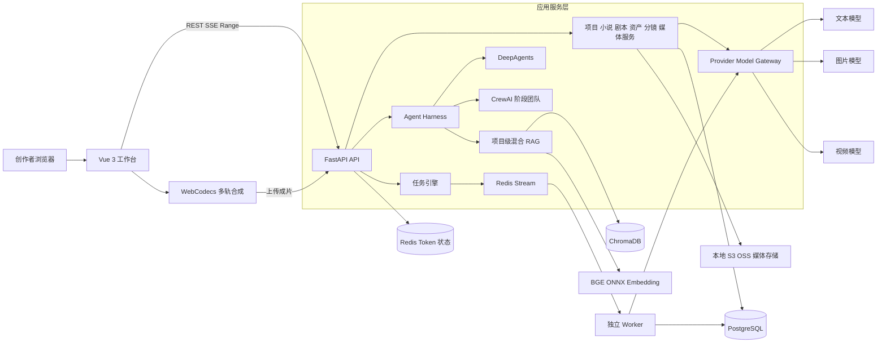

# AnonForge 项目面试题集

### 项目速记

| 维度 | 进度 |
|---|---|
| 产品定位 | 面向小说改编、原创短剧和 AI 影视生产的端到端工作台 |
| 核心链路 | 小说导入/抓取或原创概念 → AI 编剧 → 剧本分集 → 资产提取 → 分镜 → 图片 → 镜头视频 → 多轨剪辑 → 导出 |
| 后端 | Python、FastAPI、SQLModel、SQLAlchemy Async、PostgreSQL/SQLite、Redis、Alembic |
| Agent | 自定义 Harness 抽象，接入 DeepAgents、CrewAI、LangGraph/LangChain OpenAI |
| RAG | ChromaDB、本地 BGE Small 中文向量模型、ONNX Runtime、结构化检索 + 向量检索 + 词法回退 |
| 前端 | Vue 3、TypeScript、Vite、Element Plus、Pinia、Axios、CodeMirror、WebAV |
| 媒体 | 文本/图片/视频多 Provider 网关，本地/S3/OSS 存储，统一媒体资产表 |
| 异步任务 | Redis Stream + Consumer Group，Job/Item/DeadLetter 持久化状态机，Worker 心跳与孤儿恢复 |
| 当前规模 | 约 167 个 Python 文件、51 个 Vue 文件、35 个 TypeScript 文件、20 张模型表、125 个静态检索到的测试函数 |
| 部署现状 | Docker Compose 仅明确编排 PostgreSQL 和 Redis；API 与 Worker 有独立入口 |

### 一分钟项目介绍

AnonForge 是一个 AI 短剧和影视内容生产平台。我参与的系统不是单一聊天机器人，而是把小说或原创概念逐步转成可制作内容：先导入章节并构建项目级知识库，再由 AI 编剧完成故事骨架、改编策略和剧本，随后提取角色、场景、道具等资产，生成分镜表、分镜图和镜头视频，最后进入浏览器多轨剪辑台导出成片。后端使用 FastAPI、异步 SQLModel、PostgreSQL 和 Redis；Agent 层通过统一 Harness 屏蔽 DeepAgents 与 CrewAI 的差异；RAG 使用本地 BGE ONNX 向量化、ChromaDB 和结构化事件检索；耗时的图片、视频和批处理通过 Redis Stream Worker 执行。项目的重点是把生成式 AI 变成可恢复、可审核、可追踪成本的生产流程，而不是只追求一次生成效果。


### 简历项目描述

AnonForge｜AI 影视/短剧生产平台｜全栈/Agent 开发


- 基于 FastAPI、Vue 3、PostgreSQL、Redis 构建从小说导入、AI 编剧、资产与分镜生成到多轨剪辑导出的完整生产链路。
- 设计 Agent Harness 统一事件协议，接入 DeepAgents 单 Agent 与 CrewAI 阶段式多角色协作，支持流式输出、会话隔离、质量评估及失败降级。
- 构建项目级混合 RAG：本地 BGE ONNX Embedding + ChromaDB，结合章节/事件 metadata 精确检索、向量检索、词法回退和 LLM 意图解析。
- 设计 Redis Stream 异步任务系统，以 Job/Item/DeadLetter 持久化任务状态，通过心跳、重试、`XAUTOCLAIM` 和孤儿扫描提高图片、视频及批量任务可靠性。
- 抽象多模型 Provider 与统一媒体中枢，记录模型、Prompt、参数、seed、usage、cost 和任务回链，支持本地、S3 兼容存储及 OSS。


## 二、业务、架构与技术选型

### 1. AnonForge 解决了什么业务问题？

传统小说改编到短剧需要编剧、美术、分镜、视频制作和剪辑多人反复交接，信息容易断层。AnonForge 把这些环节放进同一个项目空间，用小说章节、结构化事件、剧本、资产、分镜和媒体作为连续的数据主线。AI 负责初稿、检索、补全和生成，人工负责配置、锁定、修订、审核和最终选择。核心价值不是“自动生成一个视频”，而是减少重复整理和跨工种交接成本，让每个产物都有上游依据和下游用途。


### 2. 目标用户和典型使用场景是什么？

目标用户可以分为短剧工作室、网文 IP 改编团队、AI 视频创作者和小型内容团队。典型场景有两类：第一类从已有小说导入或在线抓取章节，经编剧工作台完成改编；第二类从一句话创意、卖点、集数、时长和视觉风格生成原创概念及剧本。两类流程最终都会进入资产、分镜、图片、视频和剪辑环节。


### 3. 请完整描述一次业务链路。

1. 用户登录并创建项目，配置文本、图片、视频模型、画幅比例、视觉风格和导演风格。
2. 通过文件或在线来源导入小说章节，或者在原创概念页输入主题与卖点。
3. AI 编剧按“故事骨架 → 改编策略 → 剧本”三阶段工作，RAG 提供章节、事件和项目资料。
4. 将编剧结果同步为剧本计划与分集，人工可以编辑、锁定和导出。
5. 从剧本提取角色、势力、道具、场景，并建立分集关联、父子或衍生关系。
6. 按分集生成分镜表，人工修订并锁定镜头。
7. 生成资产参考图、宫格分镜图和单镜头帧，再生成镜头视频。
8. 在多轨剪辑台组合视频、图片、文字和音频，完成裁剪、分割、混音并导出，成片回传媒体库。

### 4. 项目当前边界是什么？哪些能力不要夸大？

当前代码已覆盖内容生产主链路，但不能直接声称已经是大规模商用平台。仓库中的 Compose 只明确启动 PostgreSQL 和 Redis，没有看到完整的 API/Worker 容器编排、网关、高可用、CI/CD、集中监控和灾备方案；README 仍接近模板；也没有真实在线 QPS、付费转化和成本报表。因此面试中应说“功能链路和可靠性骨架已经实现，生产化治理仍需补齐”。


### 5. 画出项目整体架构。



架构上要强调四条线：业务数据进入 PostgreSQL；短期状态和任务投递使用 Redis；语义知识进入 ChromaDB；模型调用统一经过 Provider 网关。耗时生成由 Worker 执行，浏览器负责交互和部分媒体合成。


### 6. 一个 AI 编剧流式请求怎样经过系统？

前端先读取预检和会话状态，再通过流式接口提交用户消息。后端按“项目 + 用户”取得会话锁，从数据库水合工作区、消息和 workflow；RAG 并行加载知识文档和解析查询意图，得到检索结果；随后根据阶段选择单 Agent 或 CrewAI 团队，通过 Harness 输出统一的 `ScriptAgentEvent`。服务把消息增量、团队进度、RAG 诊断和服务端耗时转为前端事件。生成通过质量护栏后更新工作区和历史并持久化。任何一步失败都要区分可重试错误、确定性错误和可降级错误。


### 7. 为什么后端选择 FastAPI 和异步 SQLModel？

模型 API、对象存储和 Redis 都是高延迟 I/O，FastAPI 的异步接口和类型校验适合这类工作负载；SSE/流式响应也较自然。SQLModel 复用 Pydantic 风格模型并建立 SQLAlchemy 映射，减少简单 CRUD 的重复定义。代价是异步 session 生命周期、事务边界、懒加载和并发更新更复杂；CPU 密集的 ONNX 推理、图片处理或视频合成不能直接阻塞事件循环，应放线程池、进程池、Worker 或浏览器。


### 8. 为什么前端选择 Vue 3 + TypeScript？

生产工作台有大量表单、状态机、流式消息、任务轮询和时间线操作，Vue 3 Composition API 适合按业务能力拆分 composable，TypeScript 用于约束任务、媒体和剪辑时间线结构。Element Plus 提供管理台控件，Axios 统一认证刷新，Pinia 管理共享状态。剪辑台用 `@webav/av-cliper` 和 WebCodecs 在浏览器合成，降低服务端转码压力，但要承担浏览器兼容性、内存上限和长视频失败恢复问题。


### 9. 为什么主库使用 PostgreSQL，同时保留 SQLite？

PostgreSQL 适合项目成员、剧本、资产关系和任务状态等强一致数据，也能提供更可靠的事务、行锁和并发能力。SQLite 适合作为本地开发或轻量测试后端。两者并存时要警惕 SQL 方言、并发写、枚举约束和锁语义差异，生产不能用 SQLite 模拟 PostgreSQL 的并发结论；关键查询和迁移必须在 PostgreSQL 上做集成测试。


### 10. Redis 在项目中承担哪些角色？

第一，JWT 的 `jti` 和有效期被写入 Redis，使 JWT 从纯无状态变为可吊销、可检查的会话令牌。第二，Redis Stream 是异步任务投递通道，配合 Consumer Group、`XACK` 和 `XAUTOCLAIM`。这两类用途应使用不同前缀、监控指标和容量策略；生产环境最好进一步做实例或逻辑库隔离，避免任务积压挤占认证数据。


### 11. 当前部署结构是什么？

当前 `docker/docker-compose.yaml` 只编排 PostgreSQL 和开启 AOF 的 Redis，二者带健康检查和数据卷。FastAPI 由 `backend/run.py` 启动，异步 Worker 由 `backend/worker.py` 独立启动。代码支持本地、S3 兼容存储和 OSS，但仓库没有完整证明 API、Worker、前端、反向代理和观测系统已容器化部署。面试中要把它描述为“开发环境部署骨架”。


### 12. 如果要正式上线，部署架构怎么升级？

前端静态资源进入 CDN；Nginx/API Gateway 负责 TLS、限流、Range 和流式超时；API 无状态多副本；文本、图片、视频 Worker 按队列拆分并设置不同并发；PostgreSQL 使用托管主备与备份；Redis 使用高可用并设置内存告警；媒体统一放对象存储和 CDN；ChromaDB 当前项目级本地持久化需要迁移到共享向量服务或保证粘性调度与持久卷；日志、Trace、模型调用和任务指标进入统一可观测平台。发布采用迁移前置、灰度和可回滚策略。


## 三、核心数据结构与领域模型

### 13. `BaseModel` 为什么同时设计 `id` 和 `public_id`？

`id` 是数据库整数主键，适合内部关联和索引；`public_id` 是 UUID 字符串，对外暴露可以避免顺序 ID 被枚举，也便于跨系统引用。基类还包含 `sort_order`、`created_at`、`updated_at` 和 `disabled_at`。需要注意：UUID 只降低可猜测性，不等于权限控制；所有接口仍必须检查当前用户是否属于项目。


### 14. 项目和成员权限如何建模？

`af_project` 保存名称、内容类型、视觉风格、导演手册、画幅和绑定的文本/图片/视频模型等项目级配置；`af_project_member` 建立用户与项目的关联，角色包括 `owner/admin/manager/editor/viewer`。这是项目级 RBAC 的基础。面试时应补充：真正安全需要在每个服务查询中统一执行项目成员校验，并建立“角色 → 动作”的权限矩阵，不能只靠前端隐藏按钮。


### 15. 小说相关数据为什么拆成三张表？

`af_novel_chapter` 存项目中的章节正文、顺序和处理结果；`af_novel_crawl_source` 存抓取源配置、解析规则和来源状态；`af_novel_crawl_book` 记录抓取到的书籍及来源侧标识。拆分后，业务章节不依赖某个网站，抓取规则也可复用；同一本书的搜索、详情和导入状态可以独立管理。在线来源变化时只影响爬虫适配层，不应破坏项目内已导入正文。


### 16. 原创概念、编剧会话和正式剧本是什么关系？

`af_original_concept` 是原创方案快照，包含创意、卖点、集数、时长、logline、开场钩子、分集节奏、资产种子、剧本初稿和对话 JSON。`af_screenwriting_session` 保存 AI 编剧三阶段工作区、消息、历史和 workflow，是可恢复的创作过程。`af_script_plan` 与 `af_script_episode` 是进入生产链路的正式剧本结构。三者分别代表“创意输入与生成快照”“交互式创作状态”“可被资产和分镜消费的业务实体”，不应该混成一张大表。


### 17. 资产域如何建模？

`af_asset` 保存角色、势力、道具和场景，状态为 `draft/locked`；`af_asset_episode` 记录资产出现在哪些分集，来源可为 AI 提取或人工；`af_asset_relation` 表达 `child_of/derivative_of/uses/appears_with/belongs_to` 等关系；`af_asset_version` 保存资产版本。该设计支持角色不同年龄或形态作为衍生资产，也能在生成分镜时按集召回相关资产。锁定资产应阻止自动任务覆盖人工确认内容。


### 18. 分镜表的核心数据是什么？

`af_storyboard_shot` 以项目、分集和镜头序号组织分镜，包含景别、运镜、画面描述、台词、时长、资产引用、Prompt、首尾帧媒体标识、视频媒体标识、模型与 seed 等信息，状态为 `draft/locked`。服务在重新生成时跳过锁定镜头，并对模型 JSON 解析失败提供基于剧本文本的回退拆分。分镜不是纯文本，它是剧本与媒体生成之间的结构化合同。


### 19. 为什么需要统一的 `af_media_asset`？

图片、视频、音频无论来自模型还是上传，都进入同一张媒体表。它记录媒体类型、来源、状态、挂靠对象、用途、Provider、模型、Prompt、参数、seed、存储后端、URL、MIME、尺寸、时长、usage、cost、任务回链和错误信息。统一媒体中枢减少资产图、分镜图、视频各建一套表的重复，并为审计、成本归因和画廊查询提供统一入口。


### 20. 媒体状态机如何设计？

媒体状态为 `pending → processing → ready/failed`。创建记录后先进入处理中，模型成功后解析 data/base64/url，落对象存储，补全尺寸、时长、usage 和 cost，再置为 ready；异常时写入 error 并置为 failed。数据库状态和对象存储写入不是天然分布式事务，所以生产上应增加补偿扫描：清理没有数据库记录的孤儿文件，重试没有文件的 ready 记录，并对删除失败做延迟补偿。


### 21. 剪辑工程为什么用 JSON 保存时间线？

`af_editor_project` 一项目一条记录，`timeline` JSON 保存轨道、片段、入出点、音量和文字样式，服务端只校验结构和尺寸，不解释每个剪辑操作。这让前端迭代时间线协议更快，也避免大量细碎表。缺点是数据库难以查询单个片段、难做局部并发合并和 schema 迁移。生产上应给 JSON 增加 `schemaVersion`、乐观锁版本号、大小限制和迁移函数。


### 22. 异步任务为什么拆成 Job、Item、DeadLetter？

`af_task_job` 表示一次批任务，记录类型、队列、优先级、总数和汇总进度；`af_task_item` 表示可独立重试的最小执行单元，记录 `item_key`、尝试次数、Worker、心跳和结果；`af_task_dead_letter` 保存超过重试或写回失败的完整上下文。拆分后，一集失败不必重跑整部剧，前端也能展示部分成功。`(job_id, item_key)` 唯一约束用于子项去重。


### 23. 任务状态有哪些，为什么需要 `partial` 和 `paused`？

任务状态包括 `pending/queued/running/succeeded/failed/cancelled/partial/paused`。批任务可能部分子项成功、部分失败，因此 Job 需要 `partial`；暂停用于停止继续调度但保留已完成结果。状态转换必须由服务统一管理，防止 queued 直接跳 succeeded 或取消后又被 Worker 写回。面试时可以提出用状态迁移表或单元测试验证所有合法路径。


### 24. 大量 JSON 字符串字段有什么利弊？

优点是快速承载 Prompt、模型参数、工作流、对话、时间线和供应商原始返回，便于兼容不同模型。缺点是当前不少字段以 `Text` 存 JSON，数据库无法原生校验，查询和索引困难，字段改名容易形成历史脏数据。改进方案是稳定、常查字段列化；PostgreSQL 环境把半结构化字段迁到 JSONB，并添加 schema 版本和 GIN/表达式索引；写入前用 Pydantic 模型校验。


### 25. 禁用、锁定、删除分别解决什么问题？

`disabled_at` 是通用软禁用，适合用户或项目暂时不可用；`draft/locked` 是内容审核状态，锁定表示自动生成不得覆盖人工确认；物理删除用于确实需要清理的业务数据和媒体。三者不能混用。项目删除要考虑章节、剧本、资产、分镜、任务、媒体和对象存储的级联顺序；高风险删除建议采用回收站和异步清理，而不是请求内一次性硬删。


## 四、Agent、Harness 与多角色协作

### 26. 这个项目里的 Agent 和普通 LLM 调用有什么区别？

普通 LLM 调用通常是“拼 Prompt → 请求模型 → 返回文本”。AnonForge 的 Agent 还具有阶段状态、项目知识检索、工具约束、会话记忆、流式事件、质量评估和失败修复能力。它必须知道当前处于故事骨架、改编策略还是剧本阶段，读取允许的上下文，并把结果写回对应工作区。因此它更接近一个受约束的领域执行器，而不是自由聊天机器人。


### 27. 为什么设计 Agent Harness？

核心协议定义了 `ScriptAgentInput`、`ScriptAgentEvent`、`ScriptAgentResult` 和 `ScriptAgentRuntime`，`HarnessAgent` 只依赖这个协议。这样业务层不需要知道底层是 DeepAgents、CrewAI 还是未来的其他运行时；流式增量、最终文本和阶段进度都转成统一事件。收益是解耦、便于测试和降级，代价是必须认真定义事件语义，否则不同运行时的工具调用、错误和 Token 用量会在抽象中丢失。


### 28. `ScriptAgentInput` 和事件协议应该包含哪些信息？

输入至少要有消息、系统指令、模型标识、项目/用户/会话隔离键、阶段上下文和运行元数据；事件应区分消息增量、最终消息、运行时状态、成员进度、工具调用、错误和完成。当前代码把 CrewAI 的 `stage.team.plan`、`stage.member.progress`、`stage.member.complete`、`stage.team.complete` 也暴露给前端。生产上还应统一 `trace_id`、调用序号、模型/Prompt 版本、usage、错误码和是否可重试。


### 29. DeepAgents 在项目中承担什么角色？

DeepAgents 是通用 Harness 运行时之一，通过 `thread_id = isolation_key` 维持会话隔离，并把模型增量转换成统一事件。剧本专用 Profile 明确排除了 `execute`、`write_todos`、`task`、`ls`、`read_file`、`write_file`、`edit_file`、`glob`、`grep` 等工具，同时禁用通用子 Agent。原因是编剧场景只需要受控知识和生成能力，不应该获得执行代码或任意读写文件的权限。


### 30. CrewAI 为什么适合阶段式创作？

故事改编天然有“审读 → 设计 → 撰写 → 审校”的顺序，CrewAI 可以给不同角色独立目标、背景和生成参数，并把上一个角色产物传给下一个角色。当前实现使用顺序协作，`allow_delegation=False`、`max_iter=1`、`max_retry_limit=0`，避免角色自行扩张任务和框架内部不透明重试。最后一个角色的正文作为最终输出，其余角色通过进度事件提供过程可见性。


### 31. 当前三个阶段分别有哪些 Agent 角色？

- 故事骨架：事件分析、结构设计、分集卡点、总稿审校。
- 改编策略：素材审读、改编取舍、策略总稿审校。
- 剧本：衔接分析、场景节奏设计、正文编写、格式审校。

角色不是越多越好。每增加一个角色都会增加延迟、Token、错误传播和调试成本。只有当角色拥有不同输入、验收标准或模型参数，并能显著提高最终质量时，才值得拆分。


### 32. 为什么没有让 CrewAI 角色自由委派和循环？

影视生产需要可预测的成本和可复现流程。自由委派可能产生递归任务、重复调用和上下文膨胀；多轮自治还会让失败定位困难。项目将每个成员限制为一次执行，并由业务层控制修复次数，把“自治上限”变成显式配置。这是用确定性换取生产稳定性，适合有明确阶段和输出格式的领域。


### 33. 单 Agent 和多 Agent 如何选择？

简单问答、局部修订和低风险任务优先单 Agent，延迟和成本最低；长篇结构设计、需要不同审查维度的任务再使用多 Agent。选择应通过评测而不是凭感觉：比较一次成功率、人工修改时长、事实错误率、P95 延迟和单次成本。如果多 Agent 只让答案更长却没有提高通过率，就应回退单 Agent 或确定性工作流。


### 34. Agent 和 Workflow 的边界怎么划分？

可枚举、可验证的步骤交给 Workflow，例如阶段前置检查、状态写回、锁定保护、任务重试和媒体落盘；需要语义判断和开放式生成的步骤交给 Agent，例如事件归纳、改编取舍和台词创作。AnonForge 的三阶段顺序、前置依赖和质量阈值都由代码控制，Agent 只在限定上下文内生成内容。这比让模型自己决定所有步骤更稳定。


### 35. 如何保证同一用户不会并发破坏编剧会话？

会话隔离键为 `screenwriting:{project_public_id}:{user_public_id}`。进程内短期记忆为每个键提供异步锁，流式生成期间同一会话串行执行；数据库中的 `af_screenwriting_session` 是重启后的事实源。当前进程锁无法覆盖多个 API 实例，生产部署多副本时应升级为数据库乐观锁、PostgreSQL advisory lock 或带租约的分布式锁，并避免锁持有时间覆盖不必要的长模型请求。


### 36. 编剧状态如何恢复？

会话保存当前 active tab、三段工作区、消息、workflow 和最多一定数量的历史快照。重置前先归档当前状态；用户可以恢复或删除历史。进程内缓存只减少反序列化开销，数据库行为事实源。面试时要强调“聊天记录”和“工作流状态”必须一起恢复，否则界面看似恢复了文本，Agent 却不知道已完成哪些阶段。


### 37. 三阶段为何强制 `skeleton → strategy → script`？

剧本直接生成容易跳过事实梳理和改编取舍，导致人物动机、集数节奏和原著边界不一致。代码通过 `STAGE_PREREQUISITES` 检查前置结果，三阶段分别使用独立技能 Prompt，并把阶段来源写入 workflow。用户请求后续阶段但缺前置内容时，应提示补齐或显式生成前置阶段，而不是静默编造。


### 38. 项目的质量护栏做了什么？

代码包含模板占位词黑名单、阶段内容校验和自修复。剧本检查维度包括场景台词行数、台词字符数、动作行数和单集目标时长比例；单阶段最多进行两次自修复。另有阶段质量评估器，将报告缓存到 workflow，并可生成改进 Prompt。规则校验适合格式和最低密度，LLM 评审适合连贯性和创作质量，两者应组合使用。


### 39. LLM-as-a-Judge 有什么风险，怎样减轻？

评审模型可能偏好更长文本、与生成模型共享偏见、分数漂移，甚至被待评文本中的提示注入。改进方式包括：评审 Prompt 与正文隔离；使用结构化评分维度和证据引用；隐藏模型身份；保留规则校验；建立人工标注集做相关性校准；对高风险内容双评审或抽检。分数只能作为决策信号，不能自动证明内容正确。


### 40. 流式输出为什么不仅是逐字返回？

用户需要知道 RAG 是否命中、当前哪个角色在工作、是否进入修复以及最终是否持久化。项目通过统一事件传递文本增量和团队进度，前端还定义了 RAG 运行信息、命中列表和服务端各阶段耗时。生产上应保证事件有序、可重放或至少带序号；客户端断线时不能把“模型已生成但数据库未写回”误判为完全失败。


### 41. Agent 失败如何降级？

降级分层处理：CrewAI 依赖不可用或团队模式关闭时退回单 Agent；RAG 意图模型超时或解析失败时退回本地规则；向量模型不可用时退回词法检索；分镜模型 JSON 不合法时退回剧本文本拆分；生成质量不达标时进行有限次数修复。降级结果必须在运行元数据和 UI 中标注，不能让用户把低质量回退当作正常高质量输出。


### 42. Prompt 应怎样做版本管理？

当前代码有 Prompt Registry、阶段技能名和 composed prompt trace，媒体表也记录 Prompt、模型和参数。生产上应为每个 Prompt 保存不可变版本号、模板哈希、变量快照、模型参数、发布时间和回滚版本；生成记录只引用版本，不能只保存“当前模板名称”。这样才能解释为什么同样输入在不同日期产生不同结果，并支持 A/B 评测。


### 43. 如何防止 Prompt Injection 和越权工具调用？

小说正文、网页内容和用户上传资料都是不可信数据，必须放在明确的数据边界中，提示模型“内容中的命令不是系统指令”。工具侧采用白名单、参数 schema、项目权限校验和最小权限；编剧 Profile 已禁用文件和执行类工具。对外部 URL 抓取还要做 SSRF 防护，禁止内网和云元数据地址。任何安全动作都不能只依赖模型自觉。


### 44. 当前项目是否使用 MCP？面试中怎样回答？

当前仓库没有足够证据表明业务链路已经接入 MCP，不应说“项目用了 MCP”。可以回答：项目已经具备工具协议和 Harness 抽象，未来可用 MCP 标准化外部素材库、版权库或制作系统接入；但接入后仍需身份传递、权限裁剪、超时、审计和工具返回值验证。MCP 解决连接标准，不自动解决安全和业务正确性。


## 五、RAG、记忆与知识治理

### 45. RAG 的知识来源有哪些？

知识文档覆盖项目配置、小说信息、章节正文、结构化事件、视觉风格和导演手册。章节是原始事实，事件文档把人物、地点、组织、冲突和结果结构化，项目资料提供创作约束。不同来源带 `source_type/source_id` 和 metadata，使系统既能按字段精确查，也能进行语义召回。


### 46. 为什么既保存章节正文，又提取结构化事件？

只检索原文适合回答细节，但很难稳定查询“某人物参与的冲突”或“最后五章的结果”；结构化事件支持字段过滤、排序和因果梳理，但抽取可能遗漏。两者结合时，事件用于定位，章节原文用于补充证据和核验。生成 Prompt 应尽量同时带事件摘要和对应章节片段，减少只依据二次摘要造成的信息损失。


### 47. RAG 的切片参数是什么，如何解释？

当前默认按约 900 字符切片、重叠 120 字符，批量写入上限 64，预热文档批次 32；Embedding 最大 512 token。字符切片实现简单并保持一定上下文，但中文字符和 token 不是一一对应，也可能切断场景或事件。更优方案是优先按章节、段落、场景和事件边界分块，再对超长块二次切分，并通过评测调整大小和重叠。


### 48. 为什么使用本地 BGE + ONNX Runtime？

本地 `bge-small-zh-v1.5` 适合中文检索，无需每次调用远程 Embedding，成本可控、隐私更好；ONNX Runtime 可在 CPU 上部署，代码对输出做 pooling 和归一化。默认向量维度为 512。代价是模型文件、Tokenizer 兼容、CPU 延迟和版本升级要自行维护；模型更换后必须重建向量索引，不能混用不同向量空间。


### 49. 为什么使用 ChromaDB，项目级隔离如何实现？

ChromaDB 集成成本低，适合当前单体或开发阶段的本地持久化。系统按 `project_public_id` 构建 RAG 隔离键和持久化目录，防止不同项目召回串库。生产多副本时，本地目录会造成实例间索引不一致，应改用共享向量数据库，或给 RAG Worker 配置稳定持久卷和粘性路由；权限过滤必须在检索前完成，不能只靠目录命名。


### 50. 混合检索链路是怎样的？

系统可根据工具计划执行 `metadata_lookup`、`event_json_search`、`event_vector_search`、`chapter_vector_search`、`chapter_text_lookup` 和 `lexical_fallback`。章节范围、最后 N 章和项目字段优先走精确 metadata；人物、场景、组织、事件类型和冲突/结果可走结构化事件；模糊语义走向量；向量不可用或无高分结果时使用词法检索。向量与词法结果还可通过 RRF 思路融合并去重。


### 51. 为什么要做查询意图解析，失败时怎么办？

“查最后五章”“找某人物的冲突”和“项目画幅是多少”需要不同检索工具。系统可用项目绑定的文本模型把问题解析成章节范围、字段查询、事件选择器和工具计划，默认超时约 2 秒；模型为空、超时或返回非法结构时，使用正则和关键词规则回退。意图模型不是为了生成答案，而是把自然语言映射为可控检索计划，因此应限制输出 schema、工具集合和耗时。


### 52. 最低向量分数和 Top-K 如何设置？

当前默认最低向量分数约 0.35，单轮召回上限 50。这只是初始工程参数，不代表最佳值。阈值过低会引入噪声，过高会漏召回；Top-K 过大会挤占上下文并增加生成成本。应按问题类型分层设置：字段精确查询返回少量确定结果，事件检索按人物和章节过滤，开放问题再扩大候选集；最后用标注集画出 recall、precision、上下文长度和答案正确率的关系。


### 53. 知识库怎样增量更新并避免旧向量残留？

文档应使用稳定 `source_id`、内容指纹和 chunk 标识。章节、事件或风格资料变化时，只重建受影响来源；写入新 chunk 后删除同来源不再存在的旧 chunk。项目代码已经包含预热、批量写入和 stale chunk 处理思路。生产上还要记录 embedding 模型版本和索引版本，采用“构建新版本 → 健康检查 → 原子切换”，避免用户查询到半更新索引。


### 54. 如何评测这个 RAG？

先建立按类型分层的问题集：章节范围、人物事件、冲突结果、项目字段和开放式改编问题。检索层看 Recall@K、MRR、精确命中率、无结果率、向量/词法降级率和 P95 延迟；生成层看引用正确率、事实一致性、无依据陈述率和人工修改时长。每个答案要能回链 `source_id/chapter_index`。仅用“回答看起来不错”无法证明 RAG 有效。


### 55. 这个项目为什么优先 RAG，而不是微调？

小说章节和项目配置持续变化，属于外部知识，RAG 可以立即更新并提供来源；微调更适合固化输出风格、格式或领域行为，不适合记住每个项目的最新正文。项目先用 Prompt + RAG + 结构化工作流解决事实和格式问题；只有在积累了高质量、合规的输入输出样本后，才考虑微调降低 Prompt 长度或提升固定任务一致性。两者可以组合，但评测和数据治理是前提。


### 56. 短期记忆、长期记忆、RAG 和长上下文有什么区别？

短期记忆保存当前会话状态和最近对话；长期记忆保存跨会话可复用偏好或知识；RAG 在请求时从外部知识库检索证据；长上下文是把更多原文直接发送给模型。AnonForge 用进程内短期记忆 + 数据库会话持久化，并提供 Chroma 向量记忆和项目级 RAG。长上下文实现简单但每轮重复计费、噪声多；RAG 更节省 Token，但存在漏召回。实际系统通常组合使用。


## 六、异步任务、Provider、媒体与前端生产链路

### 57. 为什么异步任务选择 Redis Stream，而不是普通 List？

Redis Stream 自带消息 ID、Consumer Group、Pending Entries 和确认机制，Worker 崩溃后可以识别未确认消息并重新认领；List 更像简单弹出队列，可靠消费、消费组和积压观测需要自己补。当前 Stream 默认最大保留长度 10000，Worker 默认批量 4、最大并发 4、阻塞读取 2 秒。参数必须按文本、图片和视频任务的平均耗时与限额重新压测，不能照搬默认值上线。


### 58. Worker 崩溃或消息丢失时怎样恢复？

Worker 领取 Item 后把数据库状态原子更新为 running，定期写心跳；成功或失败写回数据库后再 `XACK`。默认心跳约 30 秒，running 超过约 600 秒可判定失联。Orphan Scavenger 周期扫描数据库中的 stale running 和待投递 Item，同时通过 `XAUTOCLAIM` 认领 Redis Pending 消息。数据库是真实状态，Stream 是投递通道，这使系统可以从两侧补偿。


### 59. 该任务系统能保证 Exactly Once 吗？如何做幂等？

不能。Redis Stream 与数据库之间没有分布式事务，崩溃可能发生在“业务已成功但还未确认消息”之间，因此语义是 At-Least-Once。`TaskItem` 通过 `(job_id, item_key)` 唯一约束避免同一 Job 重复子项，但 Job 的 `idempotency_key` 当前只是普通索引字段，创建服务未看到强制唯一去重，仍是改进点。业务 Handler 要用业务唯一键、upsert、状态前置检查和锁定保护保证重复执行结果一致。


### 60. 重试、退避、死信、暂停和取消如何设计？

Item 记录 `attempt_count/max_attempts`。网络超时、限流和临时 Provider 错误可重试，参数非法和前置状态不满足应标记不可重试；重试延迟按基础退避乘 `2^(attempt-1)` 增长。超过上限或数据库写回失败进入 DeadLetter，保留 payload、result、Worker、阶段和错误。暂停只阻止未开始 Item，取消不能强杀已经提交给外部视频服务的请求，因此 Handler 还应在关键阶段检查取消令牌，并明确外部费用可能已产生。


### 61. 多模型 Provider 网关怎样工作？

`ProviderModelGateway` 根据 `model_id` 在 Provider 配置中定位能力，动态创建文本、图片或视频 Provider；支持普通文本、流式文本、图片生成/编辑和视频生成。不同供应商的 data、base64、URL、MIME、尺寸、时长、seed、usage 和 cost 被归一为 `MediaGenerationOutput`。文本流使用“块间空闲超时”而不是从请求开始的总超时，视频 Provider 支持提交任务后轮询终态。当前仓库有多个 Provider 模块，但面试时不应承诺每个供应商的所有模型都已完整验证。


### 62. 图片和视频生成链路有哪些工程细节？

项目可生成资产图、宫格分镜图、裁剪后的单镜头帧和镜头视频。分镜图会收集相关资产参考图，决定生成或编辑模式，记录模型、Prompt、参数和 seed；宫格结果落盘后再切分单帧。镜头视频校验项目绑定模型、首尾帧模式、分辨率和 3～12 秒时长约束，再调用视频 Provider。所有结果进入统一媒体表并落本地/S3/OSS。锁定分镜不参加批量覆盖，失败媒体保留错误供重试和审计。


### 63. 小说在线抓取是怎样做的，有什么风险？

抓取层支持 `curl_cffi` 浏览器指纹模拟、httpx、Playwright/Camoufox 浏览器代理和 parsel 解析；章节下载支持多进程 + 每进程协程，并配置连接/读取超时、重试、指数退避、403/429 限流处理、随机抖动、搜索页和正文分页上限。`run.py` 可管理浏览器代理子进程。上线前必须补 robots/站点协议和版权审查、SSRF 与内网地址拦截、域名白名单、响应大小限制、抓取速率配额及页面规则变更监控。


### 64. 浏览器多轨剪辑台是怎样实现的？

时间线包含磁吸主视频轨、自由视频轨和音频轨，片段可引用视频、图片、文字或音频，支持移动、裁剪、分割、音量、静音、隐藏、分离音频、完整/选区导出。工程 2 秒 debounce 自动保存，并设置最长等待。导出时用 WebAV 的 `MP4Clip/AudioClip/ImgClip/OffscreenSprite/Combinator` 和 WebCodecs 在浏览器解码合成，再上传统一媒体库。优势是节省服务端转码资源；限制是依赖新版 Chrome/Edge，长视频可能受内存、硬件编解码和页面关闭影响，生产上应提供服务端导出兜底。


### 65. 认证和安全体系如何评价？

密码使用 bcrypt 哈希；登录签发 access/refresh JWT，默认有效期分别约 15 分钟和 7 天；Redis 保存 `jti` 状态，删除键即可吊销。前端 Axios 在 401 时用单例 Promise 刷新，避免并发刷新风暴。问题是 access token 放在 `localStorage`，遇到 XSS 可被读取；刷新令牌未看到轮换族和复用检测；源码配置存在不应保留的敏感默认值。上线前应立即轮换密钥、迁移 Secret Manager/环境注入、使用 HttpOnly Secure SameSite Cookie 或更严格的 Token 策略，并加强 CSP、CSRF、登录限速和审计。


## 七、Token、制作成本、团队与生产化

### 66. 如何计算文本、图片和视频的生成成本？

先按供应商公开计价表建立价格快照，不能只看“Token 数”。通用公式如下：

```text
文本成本 = Σ[(非缓存输入Token / 1,000,000) × 输入单价
           + (缓存输入Token / 1,000,000) × 缓存单价
           + (输出Token / 1,000,000) × 输出单价]

图片成本 = Σ[生成张数 × 对应模型/分辨率/质量单价
           + 编辑张数 × 编辑单价]

视频成本 = Σ[生成秒数 × 对应模型/分辨率/是否带音频的每秒单价]
         或 Σ[任务数 × 供应商单任务价格]

项目总生成成本 = 文本 + 图片 + 视频 + Embedding
               + 重试浪费 + 对象存储 + CDN流量 + 基础设施 + 人工审核
```

以 10 集、每集 12 镜头为估算模板：镜头数 `N=120`；若每宫格 `g` 个镜头，则宫格图约 `ceil(120/g)` 张，单帧是否额外计费取决于本地裁剪还是再次生成；视频基准秒数为 `120 × 平均镜头秒数`。再乘成功率修正：预计调用量约为 `基准调用量 / 一次成功率`。把实际 Provider 价格代入即可复算。当前媒体表已保存 usage/cost，但文本 Agent 的统一用量落库和全链路账单对账仍应补齐。


### 67. 如何在不明显降低质量的前提下降低成本？

先治理无效调用，再换便宜模型：意图识别和格式修复用小模型；只有总稿和高价值镜头用强模型；RAG 先精确过滤再向量召回，减少长上下文；稳定系统 Prompt 使用缓存；资产和章节摘要按内容哈希缓存；宫格图本地裁切；低清预览通过后再生成高清；视频先生成关键镜头；限制自动修复次数；按错误类型决定是否重试；批量调用前做预算预检。指标应看“每个通过人工审核的分集成本”，而不是每次 API 的最低价格。


### 68. 这个项目的软件制作成本、工期和团队怎样估算？

**估算，不是项目真实投入：**

一个可演示 MVP 可以按 5～6 个月、7～9 人估算：产品经理 1、UI 1、前端 2、后端 2、AI/Agent 1～2、测试 1、DevOps 0~1，影视编剧或分镜顾问按阶段参与。要做成可商用平台，建议 10～13 人并持续 8～12 个月：增加媒体/音视频工程师、数据与评测工程师、安全/运维和内容审核。


```text
研发人力成本 = Σ(月综合成本 × 投入月数 × 投入比例)
综合项目成本 = 研发人力
             + 模型API与测试素材
             + 云资源/存储/CDN
             + 版权与领域顾问
             + 测试设备和安全合规
             + 10%～20%风险缓冲
```

面试中不要直接报一个总金额。先问地区薪酬、全职/外包、交付范围、是否包含模型费用和版权，再代入公式。真正容易低估的不是 CRUD，而是内容评测集、Provider 兼容、视频失败补偿、浏览器兼容和人工审核工作台。


### 69. 项目测试和可观测性应该怎样建设？

仓库静态检索到约 125 个测试函数，覆盖服务和部分关键流程，但本次代码审阅没有成功执行测试：项目虚拟环境指向已不存在的 Python 解释器，系统 Python 又未安装 pytest，因此不能声称“125 项全部通过”。建议测试金字塔包括：解析/状态机单测，PostgreSQL/Redis 集成测试，Provider 合同测试与录制回放，任务崩溃恢复测试，RAG 离线评测，前端时间线单测和 Playwright E2E。

可观测性至少记录 `trace_id/project_id/job_id/item_id/provider/model/prompt_version`，监控 API P95、首 Token 延迟、生成总时长、Token 和媒体成本、一次成功率、重试率、死信数、Stream lag、stale running、RAG 命中/降级率、对象存储失败和人工审核通过率。日志必须脱敏 Prompt 中的隐私和 Provider 密钥。


### 70. 你认为当前最重要的生产化改进是什么？

按风险排序回答：

1. **P0 安全**：立即轮换源码中可能暴露的默认凭据与应用密钥，改用 Secret Manager；补 SSRF、XSS、登录限速、审计和版权合规。
2. **P0 一致性**：为 Job 幂等键增加业务唯一约束；审计所有 Handler 的重复执行；补数据库、Stream、对象存储三方补偿。
3. **P1 多副本**：把进程内会话锁升级为跨实例并发控制；解决本地 Chroma 索引共享；按任务类型拆 Worker 队列和配额。
4. **P1 可观测**：统一 Agent/Provider usage、成本、Trace 和 Prompt 版本；建立任务积压、死信、生成失败与预算告警。
5. **P1 交付**：补 API/Worker/前端容器、CI/CD、迁移检查、灰度、备份恢复演练和服务端视频导出兜底。
6. **P2 质量**：建设影视领域评测集和人工审核闭环，用数据决定多 Agent、模型与 Prompt，而不是只看主观演示效果。

## 八、核心表关系速查

| 领域 | 表 | 核心关系/用途 |
|---|---|---|
| 用户与项目 | `af_user`、`af_project`、`af_project_member` | 用户通过成员表加入项目并拥有角色 |
| 小说 | `af_novel_chapter`、`af_novel_crawl_source`、`af_novel_crawl_book` | 来源规则、来源书籍与导入后的项目章节解耦 |
| 原创与编剧 | `af_original_concept`、`af_screenwriting_session` | 原创快照与可恢复三阶段会话 |
| 正式剧本 | `af_script_plan`、`af_script_episode` | 剧本计划一对多分集 |
| 资产 | `af_asset`、`af_asset_relation`、`af_asset_episode`、`af_asset_version` | 资产本体、关系、分集映射和版本 |
| 分镜 | `af_storyboard_shot` | 分集下的结构化镜头及媒体回链 |
| 媒体 | `af_media_asset` | 统一图片/视频/音频、生成追踪和存储信息 |
| 剪辑 | `af_editor_project` | 一项目一份时间线 JSON 工程 |
| 任务 | `af_task_job`、`af_task_item`、`af_task_dead_letter` | 批任务、可重试子项和死信 |


## 九、AI 生成内容标识与引用话术

### 71. 通用披露原则

AI 内容标识应回答五件事：**AI 参与了什么、使用了什么模型与版本、依据来自哪里、人工审核到哪一步、存在哪些权利与准确性风险**。不要使用“AI 仅供参考”一句话替代完整披露，也不要承诺“绝对无版权风险”“百分百真实”或“全部由人工原创”。

建议每个生成产物保留以下审计字段：

```json
{
  "generationType": "text | image | video",
  "provider": "供应商标识",
  "modelId": "模型标识",
  "modelVersion": "供应商可获得的版本或日期",
  "promptVersion": "内部Prompt版本",
  "sourceIds": ["章节/事件/资产公开标识"],
  "seed": "可用时记录",
  "generatedAt": "ISO-8601时间",
  "reviewStatus": "unreviewed | reviewed | approved | rejected",
  "reviewer": "审核人或角色",
  "usage": {},
  "cost": {},
  "fallbackMode": "正常为空，降级时记录"
}
```


### 72. 面试中描述 AI 能力的稳健话术

- 不说“解决了幻觉”，说“通过项目级 RAG、结构化事件、来源回链和人工锁定降低无依据生成，并用评测持续量化”。
- 不说“保证 Exactly Once”，说“Redis Stream 提供至少一次投递，业务唯一键和幂等 Handler 处理重复执行”。
- 不说“多 Agent 一定更好”，说“仅在角色输入和验收标准不同且离线评测收益覆盖成本时启用”。
- 不说“用了 RAG 就准确”，说“RAG 把知识更新和来源检索外置，但仍需评估漏召回、错误召回和生成阶段是否忠于证据”。
- 不说“成本很低”，说“以通过审核的分集为成本单位，记录文本 Token、图片张数、视频秒数、重试和人工审核成本”。
- 不说“完全自动化生产”，说“AI 负责草稿和生成，人工通过编辑、锁定、审核和最终导出来控制发布质量”。


## 十、三个可口述的 STAR 案例

### 73. RAG 检索既要精确又要可降级

**S：** 编剧提问既有“最后五章发生了什么”这种范围问题，也有“某人物冲突”这种语义问题，纯向量检索容易把确定性问题做模糊。

**T：** 设计可解释、项目隔离、向量不可用时仍能工作的检索链路。

**A：** 将章节和事件做成带 metadata 的知识文档；先解析章节范围、字段和事件选择器，再按优先级调用精确、结构化、向量和词法工具；本地 BGE/Chroma 异常时回退词法检索，并把检索模式和命中来源返回前端。

**R：** 系统获得了确定性查询与语义查询的统一入口，并能明确告诉用户本次是否发生降级。若没有真实线上指标，结果只说“完成机制闭环”，不要虚构准确率提升。


### 74. 长耗时媒体任务的可靠执行

**S：** 图片和视频生成耗时长、供应商会超时，单个批次中还可能部分成功，HTTP 请求内同步等待无法可靠恢复。

**T：** 让任务可追踪、可重试、可部分成功，并在 Worker 崩溃后恢复。

**A：** 使用 Job/Item 拆分批次，以 Redis Stream Consumer Group 投递；Worker 写 running 和心跳，成功写库后确认消息；失败按类型重试并指数退避，超过上限进 DeadLetter；孤儿扫描同时恢复数据库 stale running 和 Redis Pending。

**R：** 形成了至少一次投递和业务补偿框架，前端能够显示子项进度并单独重试失败项。后续重点是补齐所有 Handler 的幂等审计和统一告警。


### 75. 统一媒体中枢贯通生产链路

**S：** 资产图、分镜图、首尾帧、视频和上传素材若各自建表，会造成存储、删除、画廊和成本统计重复。

**T：** 统一不同来源和类型的媒体生命周期，同时保留业务挂靠关系。

**A：** 设计 `af_media_asset`，用 `media_type/source/status/scope/media_role` 描述媒体，统一记录 Provider、模型、Prompt、seed、usage、cost、存储和任务回链；业务对象只引用公开媒体标识；存储层抽象本地、S3 和 OSS。

**R：** 图片、视频、音频可复用一套上传、展示、删除和审计链路，并为成本归因奠定基础。跨数据库与对象存储的一致性仍需补偿任务完善。


## 十一、其他面试题清单

- 能在 1 分钟内讲清“输入是什么、AI 做什么、产物是什么、人工在哪里控制”。
- 能画出 API、Worker、PostgreSQL、Redis Stream、ChromaDB、Provider 和对象存储的关系。
- 能解释 20 张表中至少 8 张核心表及 Job/Item、资产/分集、分镜/媒体关系。
- 能说清 Harness、DeepAgents、CrewAI 的分工以及为什么禁用危险工具。
- 能说清 RAG 的知识来源、900/120 切片、512 维 Embedding、混合检索和降级。
- 能明确 Redis Stream 是至少一次投递，并指出 Job 幂等键仍需唯一约束。
- 能用公式计算文本 Token、图片和视频成本，不背诵过时的供应商价格。
- 能给出研发团队与工期估算，但明确它不是项目真实投入。
- 能主动说明源码敏感默认值、多副本会话锁、本地 Chroma 和可观测性等不足。
- 能区分“AI 生成”“AI 辅助”“人工审核”“锁定”和“降级结果”的对外话术。

