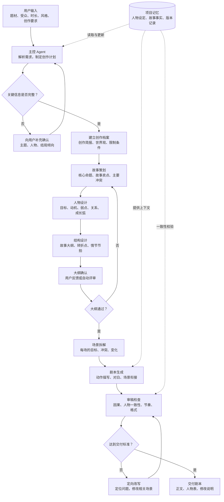

编剧agent

```mermaid
flowchart TD
    A["用户输入<br/>题材、受众、时长、风格、创作要求"] --> B["主控 Agent<br/>解析需求，制定创作计划"]
    B --> C{"关键信息是否完整？"}
    C -->|否| D["向用户补充确认<br/>主题、人物、结局倾向"]
    D --> B
    C -->|是| E["建立创作档案<br/>创作简报、世界观、限制条件"]

    E --> F["故事策划<br/>核心命题、故事卖点、主要冲突"]
    F --> G["人物设计<br/>目标、动机、弱点、关系、成长弧"]
    G --> H["结构设计<br/>故事大纲、转折点、情节节拍"]
    H --> I["大纲确认<br/>用户反馈或自动评审"]
    I --> J{"大纲通过？"}
    J -->|否| F
    J -->|是| K["场景拆解<br/>每场的目标、冲突、变化"]

    K --> L["剧本生成<br/>动作描写、对白、场景衔接"]
    L --> M["审稿检查<br/>因果、人物一致性、节奏、格式"]
    M --> N{"达到交付标准？"}
    N -->|否| O["定向改写<br/>定位问题，修改相关场景"]
    O --> M
    N -->|是| P["交付剧本<br/>正文、人物表、修改说明"]

    Q[("项目记忆<br/>人物设定、故事事实、版本记录")] -.->|读取与更新| B
    Q -.->|提供上下文| L
    Q -.->|一致性校验| M
```
